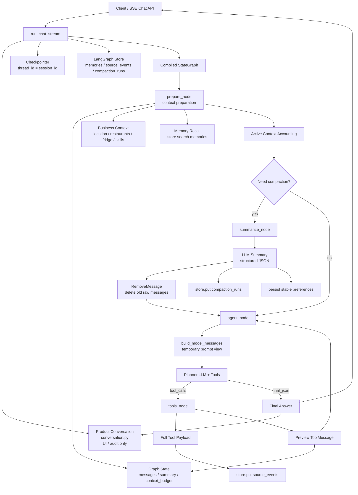
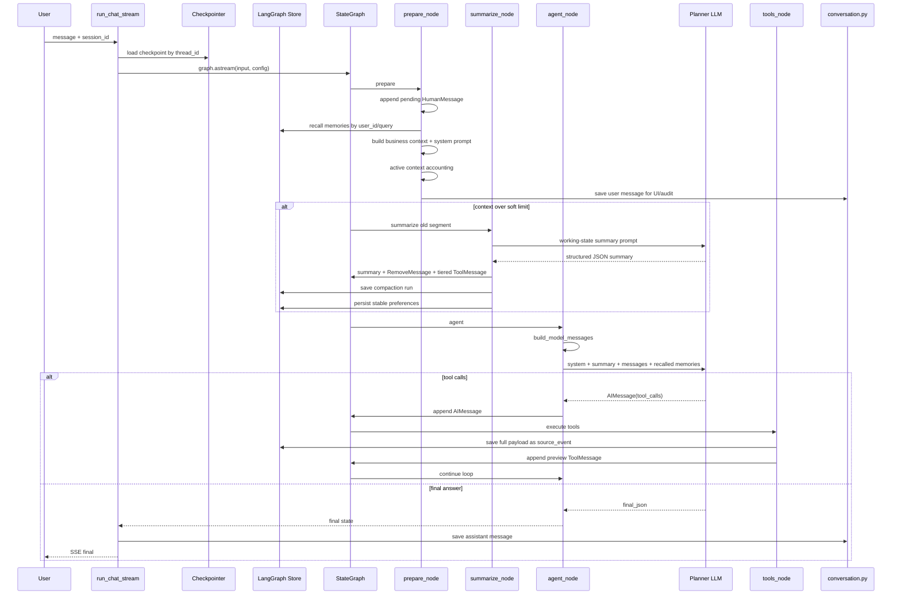
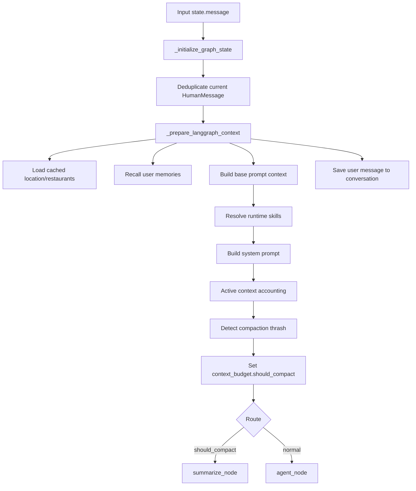
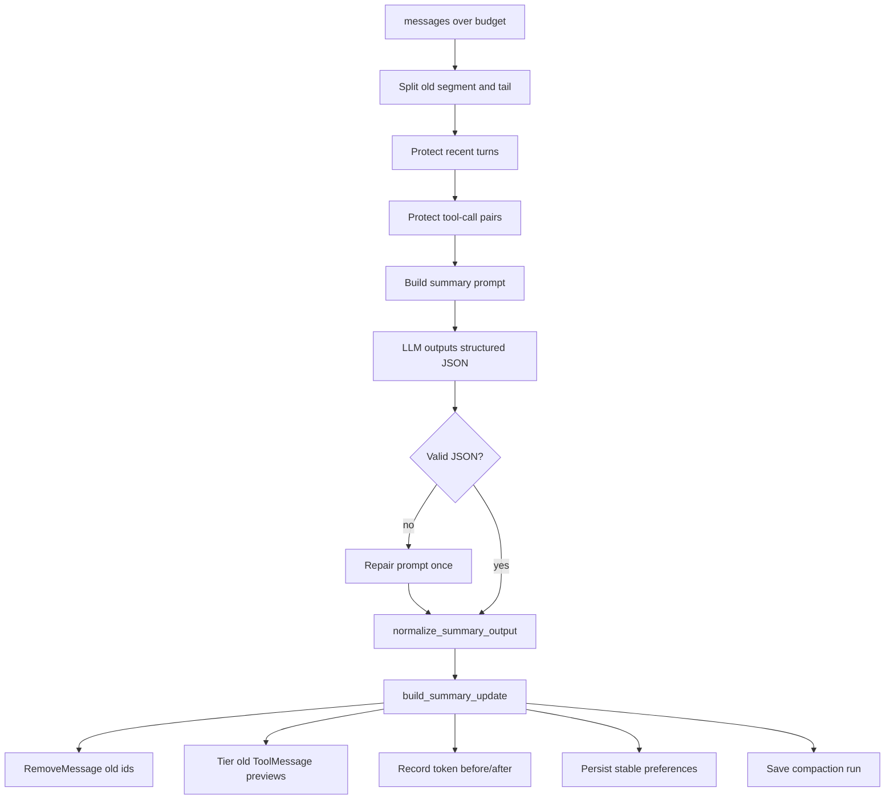
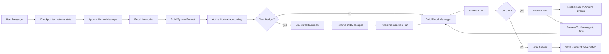

# SmartEats Context Runtime 面试复习文档

本文用于面试复习和架构讲解，目标不是逐行解释代码，而是帮助你系统回答：

- SmartEats 的上下文管理为什么从自研拼装切到 LangGraph-native？
- 每次调用大模型时到底传入哪些信息？
- 短期记忆、长期记忆、产品聊天记录分别存在哪里？
- 压缩机制如何触发、压缩哪一段、摘要提示词是什么、如何避免信息丢失？
- 工具结果为什么分层，完整 payload 为什么不直接进 prompt？
- 这套方案的优点、边界和后续可优化点是什么？

当前主链路是 **LangGraph-native context runtime**：

- 短期上下文：LangGraph `state["messages"]`。
- 短期持久化：LangGraph checkpointer，按 `thread_id=session_id` 恢复。
- 长期记忆：LangGraph store namespace `("memories", user_id)`。
- 工具源事件：LangGraph store namespace `("source_events", thread_id)`。
- 压缩观测：LangGraph store namespace `("compaction_runs", thread_id)`。
- 产品聊天记录：`app.agent.conversation`，只负责 UI 展示、落库和审计，不再作为 LLM prompt history。

---

## 1. 面试版一句话

SmartEats 的上下文管理采用 LangGraph-native 设计：以 `state.messages` 作为短期对话的唯一事实源，用 checkpointer 按会话持久化短期状态；每次调用模型时临时构造 `model_messages`，把 system prompt、业务上下文、被召回的长期记忆、历史摘要和最近原文消息组合成一次性视图；长历史通过 working-state summary + `RemoveMessage` 压缩旧完整 turn，工具完整结果不进入 prompt，而是存入可检索的 source events。

如果面试官追问“核心取舍是什么”，可以回答：

```text
短期上下文保原文，长期上下文做检索，大工具结果做源事件归档，旧对话做结构化摘要。
模型每次看到的是 runtime view，不是数据库里的全量历史。
```

---

## 2. 核心概念边界

| 概念 | 当前实现 | 是否进入模型输入 | 作用 |
| --- | --- | --- | --- |
| 短期消息 | `state["messages"]` | 是 | 最近原文对话，包含 `HumanMessage`、`AIMessage`、preview `ToolMessage` |
| 历史摘要 | `state["summary"]` | 是 | 被压缩旧消息段的 working-state summary |
| 业务上下文 | `state["context"]["system_prompt"]` | 是 | SmartEats 领域信息、工具约束、运行时 skill prompt |
| 长期记忆 | LangGraph store `("memories", user_id)` | 召回后进入 | 用户稳定偏好、可长期复用事实 |
| 工具完整结果 | LangGraph store `("source_events", thread_id)` | 默认不进入 | 大 payload 存档、可追溯、可检索 |
| 压缩记录 | LangGraph store `("compaction_runs", thread_id)` | 否 | 观测压缩质量、token before/after、错误状态 |
| 产品聊天记录 | `conversation.py` / DB / Redis | 否 | UI 展示、审计、产品 API |

这里最重要的边界是：**产品聊天记录不是 LLM prompt history**。模型上下文由 LangGraph state、summary、store retrieval 和临时 `model_messages` 决定。

---

## 3. 代码地图

```text
app/agent/graph.py
  run_chat_stream()
  创建 checkpointer/store，compile graph，并驱动 SSE 输出。

app/agent/agents/smart_eats.py
  SmartEatsGraphState
  prepare_node / summarize_node / agent_node / tools_node
  SmartEats agent 的 LangGraph 节点编排。

app/agent/langgraph_context.py
  build_model_messages()
  build_active_context_report()
  build_summary_prompt()
  build_summary_update()
  tier_tool_messages()
  normalize_summary_output()
  load/write/update/forget memories
  save/search source events
  save compaction runs

app/agent/checkpoint.py
  checkpointer_context()
  memory / sqlite / postgres checkpointer 后端。

app/agent/langgraph_store.py
  langgraph_store_context()
  memory / postgres store 后端。

app/agent/tools/context_memory.py
  memory_search / memory_write / memory_update / memory_forget / source_event_search
  Agent 可主动管理 memory 和 source events。

app/agent/conversation.py
  产品侧 ChatMessage/ChatSession 落库、Redis/local cache。
```

---

## 4. 总体架构



架构上有三个关键原则：

1. **State is the short-term source of truth**  
   短期上下文不再从旧 history 表、Redis cache 或自研 context event 表拼出来，而是由 LangGraph `messages` 持有。

2. **Model input is a derived view**  
   `model_messages` 是一次调用模型前临时渲染出来的视图，不会整体写回 state。

3. **Large and durable knowledge is externalized**  
   长期偏好、工具完整结果、压缩运行记录进入 store；模型只拿本轮必要片段。

---

## 5. State 设计

当前核心状态：

```python
class SmartEatsGraphState(TypedDict, total=False):
    messages: Annotated[list[Any], add_messages]
    session_id: str
    user_id: str | None
    message: str | None
    context: dict[str, Any] | None
    summary: str | None
    context_budget: dict[str, Any]
    retrieved_memories: list[dict[str, Any]]
    source_refs: list[dict[str, Any]]
```

字段解释：

- `messages`：LangGraph 短期消息队列，由 `add_messages` reducer 追加/删除/替换。
- `summary`：旧消息段压缩后的结构化摘要字符串。
- `context`：本轮业务上下文和 system prompt 的运行时容器。
- `context_budget`：active context 统计、是否需要压缩、压缩收益、防抖状态。
- `retrieved_memories`：本轮从 `("memories", user_id)` 召回的长期记忆。
- `source_refs`：本轮工具完整结果写入 source events 后形成的可追溯引用。

面试回答重点：

```text
messages 保存原文短期上下文，summary 保存被删除旧消息的语义压缩结果，
context_budget 决定是否压缩，retrieved_memories 和 source_refs 是本轮检索/归档结果。
```

---

## 6. 一轮请求的时序



---

## 7. 每次调用模型时给什么

`agent_node` 调用 `build_model_messages()` 构造临时输入：

```text
model_messages =
  [
    SystemMessage(system_prompt + recalled long_term_memories),
    Optional SystemMessage(<conversation_summary>...</conversation_summary>),
    *state["messages"],
  ]
```

顺序含义：

1. **SystemMessage #1**  
   包含 SmartEats system prompt、业务上下文、工具约束、技能 prompt，以及本轮召回的长期记忆。

2. **SystemMessage #2，可选**  
   包含 `<conversation_summary>`，并明确声明最近原文消息比 summary 更权威。

3. **原生 messages**  
   包含用户消息、assistant 工具调用消息、工具 preview 观察结果等。

不会直接给模型：

- 全量产品聊天记录。
- 全量长期记忆。
- 工具完整 payload。
- 压缩运行记录。
- debug snapshot。
- 没有被召回的 memory。

面试时可以强调：**这不是简单 history 拼接，而是 runtime prompt view composition**。

---

## 8. Prepare Node 机制



`prepare_node` 的职责不是调用模型，而是准备运行时上下文：

- 去重追加当前 `HumanMessage`。
- 清空旧 `state.history`，避免旧 history 链路继续影响 prompt。
- 读取 location、restaurant cache 等业务信息。
- 从 store 召回用户长期记忆。
- 生成 system prompt。
- 计算 active context report。
- 决定是否进入 summarize node。
- 保存产品侧用户消息。

---

## 9. Active Context Accounting

当前压缩阈值不是固定 8K，而是 model-aware：

```text
model_context_window = resolve_model_context_window(provider, model)
usable_context_window = model_context_window - reserved_output_tokens - reserved_tool_tokens
soft_limit = usable_context_window * CHAT_COMPACT_TRIGGER_RATIO
hard_limit = usable_context_window * CHAT_COMPACT_HARD_RATIO
total_tokens = system + summary + messages + memories + business_context
```

默认配置：

```text
LLM_MODEL_CONTEXT_SIZE = 128000
LLM_MODEL_CONTEXT_WINDOWS =
  qwen:qwen3.5-flash=128000,
  qwen:qwen3.5-plus=128000,
  deepseek:deepseek-chat=64000,
  gpt-4.1=1047576,
  gpt-5=400000

CHAT_COMPACT_TRIGGER_RATIO = 0.8
CHAT_COMPACT_HARD_RATIO = 0.92
CHAT_COMPACT_RESERVED_OUTPUT_TOKENS = 8000
CHAT_COMPACT_RESERVED_TOOL_TOKENS = 16000
CHAT_COMPACT_MIN_MESSAGES = 3
```

`build_active_context_report()` 输出：

```json
{
  "model_context_window": 128000,
  "usable_context_window": 104000,
  "reserved_tokens": {"output": 8000, "tool": 16000},
  "buckets": {
    "system": 1000,
    "summary": 500,
    "messages": 12000,
    "memories": 800,
    "business_context": 0
  },
  "total_tokens": 14300,
  "soft_limit": 83200,
  "hard_limit": 95680,
  "should_compact": false,
  "over_hard_limit": false
}
```

这个设计的面试亮点：

- 适配不同模型上下文窗口，不把所有模型都按 8K 处理。
- 预留 output/tool token，避免输入吃满导致模型无空间输出或工具循环。
- 按 bucket 统计，方便定位上下文膨胀来源。
- 将压缩触发从“消息条数”升级为“token budget + message count”。

---

## 10. 压缩机制

### 10.1 压缩目标

当前压缩不是全文摘要，而是 **旧段/中间段压缩**：

```text
已有 summary + 待压缩旧消息段 -> 新 working-state summary
最近 tail messages -> 原文保留
未完成 tool-call pair -> 原文保护
```

为什么不是全文压缩？

- 最新几轮往往包含当前任务状态，保留原文可靠性更高。
- 工具调用链需要保持 `AIMessage.tool_calls` 和 `ToolMessage.tool_call_id` 配对，否则 LangGraph/OpenAI tool message 语义可能断裂。
- 摘要适合承载历史决策、用户目标、已完成动作，不适合替代最新交互细节。

### 10.2 触发条件

`prepare_node` 中设置：

```text
context_budget["should_compact"] =
  total_tokens >= soft_limit
  and message_count >= CHAT_COMPACT_MIN_MESSAGES
  and not compact_blocked
```

路由函数检测到 `should_compact` 后进入 `summarize_node`。

### 10.3 保留范围

`summarize_node` 先根据比例计算 tail：

```python
keep_recent = max(2, int(len(messages) * CHAT_COMPACT_TAIL_RATIO))
keep_recent = max(keep_recent, 4)

user_turn_count = count_human_messages(messages)
keep_recent_turns = max(2, int(user_turn_count * CHAT_COMPACT_TAIL_RATIO))
```

`build_summary_update()` 再通过 `_protected_recent_start()` 调整边界：

- 至少保留最近 `keep_recent` 条消息。
- 至少保留最近 `keep_recent_turns` 个用户 turn。
- 如果 tail 中有 tool call 或 tool message，向前保护对应 pair。
- 旧段消息生成 `RemoveMessage(id=...)` 从 state 删除。

### 10.4 压缩算法



### 10.5 摘要提示词

当前 `build_summary_prompt()` 的核心要求：

```text
你在为 SmartEats agent 生成 Claude-Code-like working-state compact summary。
下一个模型看不到被压缩的旧消息，只能看到你的 JSON、保留的最近原文消息、长期记忆和可检索 source refs。
请把下面旧对话压缩为严格 JSON 对象。只总结旧消息，不要虚构最新状态。
必须只输出 JSON，不要 Markdown，不要解释。
```

要求字段：

```text
summary
latest_user_intent
task_state
user_goals
stable_preferences
user_preferences
decisions
tool_results
open_questions
next_steps
avoid_repeating
current_task_state
coverage
```

字段设计的意图：

| 字段 | 面试解释 |
| --- | --- |
| `summary` | 给后续模型继续任务用的整体工作状态 |
| `latest_user_intent` | 被压缩旧段内最后明确意图，避免误覆盖 tail 中的新意图 |
| `task_state` | 阶段、下一步、阻塞项 |
| `user_goals` | 用户目标，避免压缩后丢需求 |
| `stable_preferences` | 可沉淀为长期记忆的稳定偏好 |
| `decisions` | 已确认/暂定/废弃的选择和约束 |
| `tool_results` | 工具名、调用 ID、source event ID、关键事实、错误 |
| `open_questions` | 未解决问题和是否需要问用户 |
| `next_steps` | 后续执行动作 |
| `avoid_repeating` | 已做过、失败过、用户拒绝过的动作 |
| `coverage` | 摘要覆盖了哪些消息和 source events |

### 10.6 JSON Normalize / Repair

LLM 摘要输出会经过 `normalize_summary_output()`：

- 支持剥离 ```json fenced block。
- 支持从混杂文本中提取 JSON object。
- 如果解析失败，退化为 `{"summary": raw[:1600]}`。
- 补齐所有 schema 字段。
- list 字段统一为数组。
- object 字段补默认结构。
- 生成 canonical JSON 字符串写入 `state.summary`。

如果第一次不是合法 JSON，`summarize_node` 会用 `build_summary_repair_prompt()` 进行一次修复。

### 10.7 摘要后的 state 更新

`build_summary_update()` 返回：

```python
{
    "summary": summary_text,
    "summary_json": summary_payload,
    "messages": [RemoveMessage(...), *tier_replacements],
    "context_budget": {
        "status": "summarized",
        "removed_message_count": ...,
        "covered_message_ids": ...,
        "source_refs": ...,
        "token_before": ...,
        "token_after": ...,
        "last_compaction_reduction_ratio": ...,
        "compression_ratio": ...,
    },
}
```

这一步体现了成熟压缩系统的几个要点：

- 可删除：通过 `RemoveMessage` 真正减少 state message 体积。
- 可追踪：记录 covered message IDs 和 covered source event IDs。
- 可观测：记录 token before/after 和压缩率。
- 可恢复：source refs 仍可通过 `source_event_search` 找回细节。

---

## 11. Tool Output Tiering

工具结果分三层：

| 层级 | 存放位置 | 是否进模型 | 内容 |
| --- | --- | --- | --- |
| Full payload | `source_events` store | 否 | 完整工具参数、完整结果、metadata |
| Preview ToolMessage | `state.messages` | 是 | 给模型继续推理所需的 facts/preview |
| Archived preview | `state.messages` 中替换旧 ToolMessage | 是 | 更短 JSON，带 retrieval hint |

压缩时 `tier_tool_messages()` 会保留最近少量工具 preview，对更旧的工具消息降级为：

```json
{
  "tier": "archived_tool_preview",
  "tool_name": "...",
  "tool_call_id": "...",
  "content_preview": "...",
  "retrieval_hint": "Full tool result can be searched with source_event_search."
}
```

面试解释：

```text
工具结果往往是上下文膨胀的主要来源，所以 prompt 里只放可继续推理的摘要；
完整 payload 进入 source_events，保证可追溯和可检索。
```

---

## 12. Compact Thrash Guard

问题：如果 system prompt、附件或工具 preview 本身很大，压缩旧 messages 后仍然超限，系统可能每轮都压缩，收益很低。

当前实现：

```text
blocked =
  active_context.total_tokens >= hard_limit
  and compact_attempts >= CHAT_COMPACT_MAX_ATTEMPTS
  and last_compaction_reduction_ratio < CHAT_COMPACT_MIN_REDUCTION_RATIO
```

默认：

```text
CHAT_COMPACT_MAX_ATTEMPTS = 2
CHAT_COMPACT_MIN_REDUCTION_RATIO = 0.05
```

触发后：

```text
context_budget.status = compact_blocked
context_budget.compact_blocked = true
context_budget.compact_blocked_reason = low_value_repeated_compaction
```

这是防止“压缩抖动”的机制，属于工程化上下文管理里很重要的一点。

---

## 13. 长期记忆机制

长期记忆 namespace：

```text
("memories", user_id)
```

写入来源：

- Agent 主动调用 `memory_write`。
- 用户纠正时调用 `memory_update`。
- 用户要求忘记时调用 `memory_forget`。
- 压缩摘要中高置信 `stable_preferences` 通过 `persist_summary_memories()` 自动沉淀。

召回方式：

```text
load_user_memories(store, user_id, query=current_user_message, limit=5)
```

进入模型的格式：

```text
<long_term_memories>
- id=... kind=stable_preference confidence=0.9: 用户不吃香菜
</long_term_memories>
```

设计取舍：

- 不把全量 memory 塞给模型，避免污染和膨胀。
- 只召回本轮相关 memory，保持 prompt 精简。
- 允许 agent 主动管理 memory，提高长期个性化能力。

---

## 14. Source Events 机制

工具完整结果存储在：

```text
("source_events", thread_id)
```

典型结构：

```json
{
  "tool_name": "search_restaurants",
  "tool_call_id": "call_1",
  "args": {"query": "火锅"},
  "result": {"restaurants": "...full payload..."},
  "preview": {"names": ["山城火锅"]},
  "content_preview": "...short text...",
  "checkpoint_id": null,
  "created_at": "..."
}
```

作用：

- 让完整工具结果不污染 prompt。
- 摘要只保存 `source_event_id` 和关键事实。
- 后续模型需要细节时调用 `source_event_search`。
- debug snapshot 可以显示脱敏 preview，而不是泄露完整 payload。

---

## 15. Checkpointer 与 Store

### 15.1 Checkpointer

配置：

```text
LANGGRAPH_CHECKPOINT_BACKEND = sqlite | memory | postgres | disabled
LANGGRAPH_CHECKPOINT_DB = .langgraph_checkpoints.sqlite
LANGGRAPH_DURABILITY = async
```

作用：

- 按 `thread_id=session_id` 保存 LangGraph state。
- 恢复 `messages`、`summary`、`context_budget` 等短期状态。
- 支持中断恢复和 checkpoint replay。

### 15.2 Store

配置：

```text
LANGGRAPH_STORE_BACKEND = postgres | memory | disabled
LANGGRAPH_STORE_DB = None
```

namespace：

```text
("memories", user_id)
("source_events", thread_id)
("compaction_runs", thread_id)
```

面试可讲：

```text
checkpointer 管短期线程状态，store 管跨线程或可检索的长期/外部化信息。
这两个职责分离，避免把所有东西都塞进 messages。
```

---

## 16. Product Conversation 与 Prompt History 的区别

`app.agent.conversation` 负责：

- `save_user_message()`
- `save_tool_message()`
- `save_assistant_message()`
- `append_conversation_cache()`
- `clear_session_cache()`

Redis 新 key：

```text
chat:conversation:{session_id}
chat:conversation:{session_id}:sig
```

仍清理旧 key：

```text
chat:history:{session_id}
chat:history:{session_id}:sig
```

这只是兼容清理旧缓存残留，不代表旧 history 仍参与模型上下文。

面试回答：

```text
conversation 是产品记录，messages 是模型短期上下文。
前者为了展示和审计，后者为了推理。
两者不能混用，否则会造成 prompt 泄露、重复注入和上下文不可控。
```

---

## 17. Debug 与安全边界

`ContextService.build_debug_snapshot()` 输出脱敏快照，主要包括：

- runtime 类型。
- source event 数量和 preview。
- compaction run 状态。
- namespace metadata。

不会暴露：

- 完整 system prompt。
- 完整 memory store。
- 完整工具 payload。
- checkpointer 里的全部 messages。

这体现了上下文系统的安全边界：**可观测不等于全量泄露**。

---

## 18. 与旧方案对比

| 维度 | 旧方案 | 当前 LangGraph-native 方案 |
| --- | --- | --- |
| 短期上下文来源 | 自研 history/context 拼接 | `state.messages` |
| 持久化 | 自研表、Redis history | LangGraph checkpointer |
| 模型输入 | 手工拼 `history/memory/context_overrides` | 临时 `build_model_messages()` |
| 压缩 | 字符串 summary/history 裁剪 | 结构化 working-state summary + `RemoveMessage` |
| 工具结果 | 容易混入 prompt history | preview 进 messages，full payload 进 source_events |
| 长期记忆 | 自研 memory 逻辑 | LangGraph store namespace |
| 可观测性 | 分散 | `context_budget` + `compaction_runs` |
| 职责边界 | 产品历史和 prompt history 易混淆 | `conversation.py` 与 graph state 分离 |

当前方案的优势：

- 更贴合 LangGraph 官方状态模型。
- 减少自研 context engine 和 graph state 双写问题。
- 短期、长期、工具源事件、产品记录边界更清楚。
- 压缩可观测，可做后续评估和治理。

---

## 19. 面试常见追问

### Q1：为什么不直接把所有历史都给模型？

因为历史可能非常长，工具结果也可能很大。全量塞入会带来 token 成本、延迟、注意力稀释、隐私泄露和输出空间不足。当前方案保留最近原文，旧消息结构化摘要，长期信息按需召回，大 payload 外部化为 source events。

### Q2：summary 为什么不直接替代所有 messages？

summary 是有损压缩，不适合替代最新任务状态。最近原文更权威，尤其是用户刚改需求、工具刚返回结果、tool call pair 还未完成时。因此系统只压缩旧完整段，保留 tail。

### Q3：如何避免压缩后丢工具结论？

摘要 schema 要求保留 `tool_results`，包括 `tool_name`、`tool_call_id`、`source_event_id`、关键事实和错误。同时完整工具 payload 存入 source events，可通过 `source_event_search` 检索。

### Q4：如何避免模型重复调用工具？

摘要中有 `avoid_repeating` 和 `tool_results`；tail 中也保留最近工具 preview。模型可以看到哪些动作已完成、失败或被用户拒绝。

### Q5：长期记忆和 summary 有什么区别？

summary 是会话内的工作状态压缩，解决“这条 thread 之前做到了哪里”；memory 是跨轮次/跨会话可复用的稳定事实，解决“这个用户长期偏好是什么”。

### Q6：checkpointer 和 store 有什么区别？

checkpointer 保存 graph state，用于恢复当前 thread；store 保存可检索的长期信息和源事件，namespace 更灵活，不等同于当前执行状态。

### Q7：这套系统还可以怎么优化？

- 使用真实 tokenizer 替代启发式 token 估算。
- 对 summary 做事实一致性 eval 或 LLM judge。
- 给 memory 加 embedding/vector 检索和更严格的 metadata filter。
- 给 source events 建更强的检索索引。
- 对不同工具定义不同 preview schema。
- 对 compact run 建 dashboard，观察压缩频率、收益和失败率。

---

## 20. 复习用流程总图



---

## 21. 配置速查

```text
LLM_MODEL_CONTEXT_SIZE=128000
LLM_MODEL_CONTEXT_WINDOWS=qwen:qwen3.5-flash=128000,qwen:qwen3.5-plus=128000,deepseek:deepseek-chat=64000,gpt-4.1=1047576,gpt-5=400000

CHAT_COMPACT_TRIGGER_RATIO=0.8
CHAT_COMPACT_HARD_RATIO=0.92
CHAT_COMPACT_MIN_MESSAGES=3
CHAT_COMPACT_TAIL_RATIO=0.2
CHAT_COMPACT_RESERVED_OUTPUT_TOKENS=8000
CHAT_COMPACT_RESERVED_TOOL_TOKENS=16000
CHAT_COMPACT_MAX_ATTEMPTS=2
CHAT_COMPACT_MIN_REDUCTION_RATIO=0.05

LANGGRAPH_CHECKPOINT_BACKEND=sqlite
LANGGRAPH_CHECKPOINT_DB=.langgraph_checkpoints.sqlite
LANGGRAPH_DURABILITY=async

LANGGRAPH_STORE_BACKEND=postgres
LANGGRAPH_STORE_DB=
```

---

## 22. 测试与验证

核心测试文件：

```text
app/tests/test_langgraph_native_context.py
```

重点覆盖：

- `build_model_messages()` 只临时注入 system/summary/memories，不污染 state messages。
- model-aware context window 解析。
- active context budget 统计。
- `build_summary_update()` 删除旧消息、保护 tail、记录 coverage。
- `tier_tool_messages()` 工具 preview 分层。
- `detect_compact_thrash()` 低收益压缩防抖。
- `normalize_summary_output()` JSON normalize/repair。
- `persist_summary_memories()` 从稳定偏好写入长期记忆。
- memory/source event tools 使用 LangGraph store namespace。

建议面试时补一句：

```text
上下文系统的测试重点不是只测函数返回，而是要验证“模型最终看见什么”和“state/store 最终留下什么”。
```

常用命令：

```bash
rg -n "build_model_messages|build_summary_update|context_budget" app/agent
rg -n "memory_search|source_event_search|save_source_event" app
/opt/miniconda3/envs/smarteats/bin/python -m pytest app/tests/test_langgraph_native_context.py -q
```

