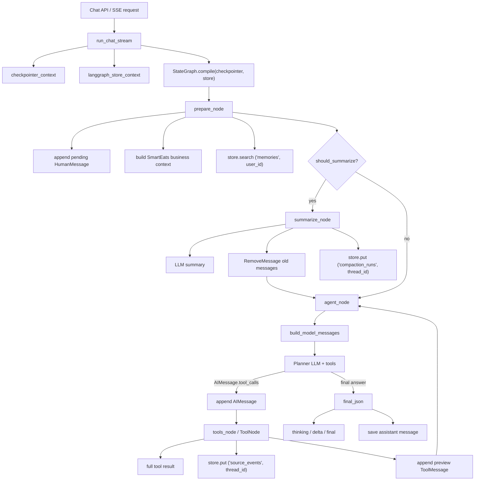
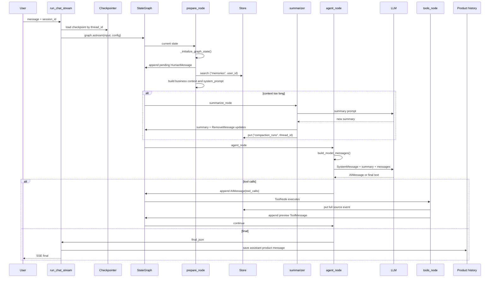
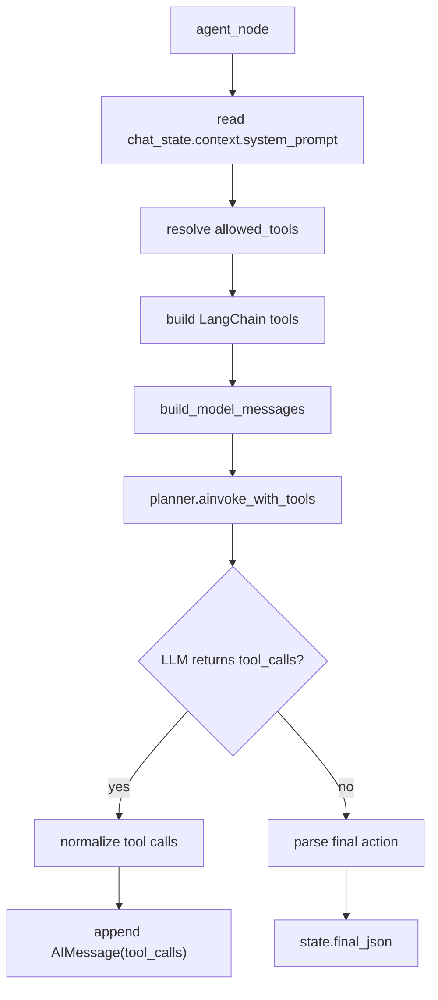
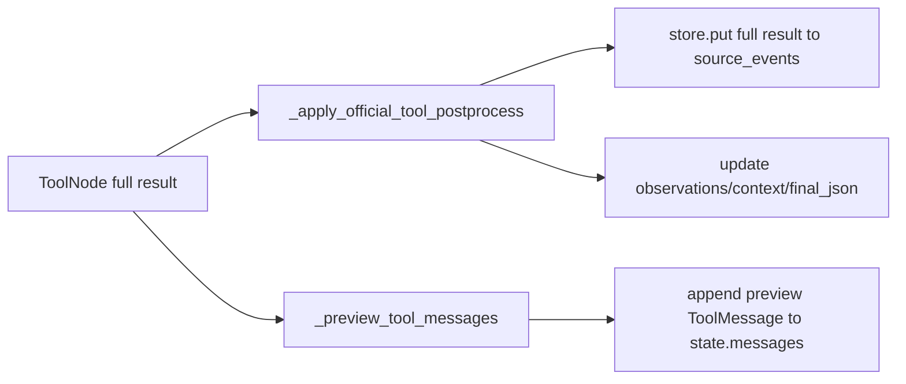
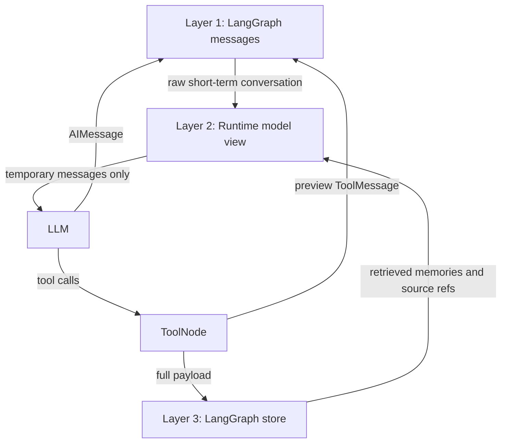

# SmartEats LangGraph-Native 上下文管理学习说明文档

本文档说明 SmartEats 当前版本的上下文管理实现。当前主链路已经从自研 `ContextEngine.prepare()` 切换为 LangGraph-native runtime：短期上下文由 `StateGraph` state 的 `messages` 承载，持久化由 checkpointer 按 `thread_id` 管理，长期记忆、工具源事件、压缩观测数据由 LangGraph store 管理。

旧版 `app/context_engine/` 已经从代码库移除；旧 `history/memory/context_overrides` 拼装模型输入的方式也不再是主链路。`app.agent.history` 仍用于产品聊天记录展示和审计，但不再作为 LLM prompt 的历史来源。

## 1. 当前结论

- 短期对话上下文唯一真相源：`SmartEatsGraphState.messages: Annotated[list[Any], add_messages]`。
- 每个新用户 turn 只向 graph 输入本轮 `HumanMessage`，历史由 LangGraph checkpointer 自动恢复。
- 调模型前临时构造 `model_messages`，包含 system prompt、业务上下文、长期记忆、历史摘要和 `state.messages`。
- 临时注入的 `SystemMessage`、长期记忆、业务事实不会写回 `state.messages`。
- 工具完整结果不会进入 prompt；写入 state 的 `ToolMessage` 只保留 preview/facts。
- 完整工具结果作为可检索源事件写入 LangGraph store 的 `("source_events", thread_id)`。
- 长期记忆写入 LangGraph store 的 `("memories", user_id)`。
- 压缩结果写回 state 的 `summary`，被压缩旧消息用 `RemoveMessage` 从 `messages` 删除。
- 压缩观测记录写入 LangGraph store 的 `("compaction_runs", thread_id)`。

## 2. 代码地图

```text
app/agent/graph.py
  run_chat_stream()
  checkpointer_context() + langgraph_store_context()
  graph.compile(checkpointer=..., store=...)

app/agent/agents/smart_eats.py
  SmartEatsState
  SmartEatsGraphState
  _initialize_graph_state()
  _prepare_langgraph_context()
  summarize_node()
  agent_node()
  tools_node()

app/agent/langgraph_context.py
  build_model_messages()
  should_summarize()
  build_summary_prompt()
  build_summary_update()
  load_user_memories()
  write_user_memory()
  update_user_memory()
  forget_user_memory()
  save_source_event()
  search_source_events()
  save_compaction_run()

app/agent/langgraph_store.py
  langgraph_store_context()
  memory / postgres store backend

app/agent/checkpoint.py
  checkpointer_context()
  memory / sqlite / postgres checkpointer backend

app/agent/tools/context_memory.py
  memory_search
  memory_write
  memory_update
  memory_forget
  source_event_search

app/domain/context/service.py
  ContextService.build_debug_snapshot()
```

## 3. 总体架构



这套架构的核心变化是：上下文不再先被自研引擎拼成 `PreparedContext.messages`，再覆盖 graph state。现在 graph state 自己就是短期上下文载体，模型输入只是基于 state 临时渲染出来的一次性 view。

## 4. State 设计

当前 `SmartEatsGraphState` 是 `TypedDict`，其中最关键的是：

```python
class SmartEatsGraphState(TypedDict, total=False):
    messages: Annotated[list[Any], add_messages]
    session_id: str
    user_id: str | None
    message: str | None
    context: dict[str, Any] | None
    summary: str | None
    context_budget: dict[str, Any]
    retrieved_memories: list[dict[str, Any]]
    source_refs: list[dict[str, Any]]
```

字段职责：

- `messages`：短期对话历史，保存 `HumanMessage`、`AIMessage`、preview `ToolMessage`。这是 LLM raw history 的唯一来源。
- `summary`：被压缩旧消息的结构化摘要文本。它是 state 字段，不是 message。
- `context`：本轮 SmartEats 业务上下文和 system prompt 的暂存区。
- `context_budget`：本轮上下文统计，包括消息数、压缩状态、压缩前后 token 估算等。
- `retrieved_memories`：本轮从长期记忆 namespace 检索出的 memory 引用。
- `source_refs`：本轮工具源事件写入 store 后返回的引用。

`SmartEatsState` 是业务 dataclass，节点内部用它做业务状态处理；`SmartEatsGraphState` 是 LangGraph 持久化 state schema。

## 5. 一轮对话的执行流程



## 6. 每次调用大模型时到底给什么

`agent_node` 不直接把 `state.context` 或 store 里的数据整体塞给模型，而是调用 `build_model_messages()` 生成临时输入：

```python
planner_messages = build_model_messages(
    system_prompt=system,
    summary=chat_state.summary,
    messages=state_messages,
    memories=chat_state.retrieved_memories,
)
```

最终传给 planner 的顺序是：

```text
1. SystemMessage
   - SmartEats system prompt
   - 当前业务上下文
   - runtime skill prompt
   - <long_term_memories>...</long_term_memories>

2. 可选 SystemMessage
   - <conversation_summary>...</conversation_summary>
   - "Recent raw messages after this summary are authoritative."

3. state["messages"]
   - HumanMessage
   - AIMessage
   - preview ToolMessage
```

不会直接给模型的内容：

- LangGraph store 里的完整 memory 集合。
- `source_events` 里的完整工具 payload。
- `compaction_runs` 里的压缩观测记录。
- 产品聊天记录表里的历史消息。
- debug snapshot。
- 未被检索命中的长期记忆。
- 工具返回的完整大 JSON。

所以，模型每次看到的是“当前 system view + 可选历史摘要 + checkpointer 恢复出的短期原生 messages + 本轮检索命中的 memory preview”。

## 7. prepare_node 机制

`prepare_node` 做三件事：

1. `_initialize_graph_state()`：把当前 `state.message` 转成待追加的 `HumanMessage`。如果 checkpoint 中最新 human message 已经是当前内容，则不重复追加。
2. `_prepare_langgraph_context()`：构造本轮业务上下文、系统提示词、工具 allowlist、长期记忆检索结果和 budget 统计。
3. 返回 `output["messages"] = pending_messages`，让 LangGraph 的 `add_messages` reducer 追加消息。

关键点：

- 它不会把历史 `messages` 重写为自研 engine 输出。
- 它会把 `state.history` 清空，避免旧 history 链路参与 prompt。
- 它会从 Redis 读取位置和餐厅缓存，再合并到业务上下文。
- 它会从 store 的 `("memories", user_id)` namespace 召回长期记忆。
- 它会把 `langgraph_native=True`、`context_budget`、`allowed_tools`、`system_prompt` 放入 `state.context`。

## 8. agent_node 机制

`agent_node` 的职责是把当前 state 渲染成一次 LLM 调用，并规范化返回结果。



`OpenAIPlanner.ainvoke_with_tools()` 支持两种模式：

- 简单 `SystemMessage + HumanMessage` 或测试 monkeypatch 场景：降级为 legacy `system/user` 调用。
- 多消息上下文场景：走 `plan_native_messages_with_tools()`，保留原生 message 结构。

这保证当前主链路是 native messages，同时兼容已有测试和部分旧调用。

## 9. tools_node 机制

工具执行仍然使用 LangGraph 官方 `ToolNode` 和原生工具调用格式：

```text
AIMessage.tool_calls -> ToolNode -> ToolMessage
```

但工具结果被拆成两层：



具体策略：

- `_apply_official_tool_postprocess()` 使用完整工具结果更新业务状态，例如位置、餐厅、路线、菜谱、fallback final。
- `save_source_event()` 把完整工具结果写入 `("source_events", thread_id)`。
- `_preview_tool_messages()` 生成 preview `ToolMessage`，只把摘要、关键 facts 或裁剪后的内容写回 `state.messages`。
- 下一轮模型默认只看到 preview，不看到完整 payload。
- 如果模型需要追溯细节，可以调用 `source_event_search` 检索源事件 preview。

## 10. 压缩机制

当前压缩是 LangGraph-native 的 `summary + RemoveMessage`，不是旧版 condensation event。

### 10.1 触发条件

`prepare_node` 先生成 `active_context` budget report，`_route_after_prepare()` 再读取 `context_budget["should_compact"]`：

```python
active_report = build_active_context_report(
    system_prompt=system_prompt,
    messages=visible_messages,
    summary=state.summary,
    memories=state.retrieved_memories,
    model_context_window=resolve_model_context_window(...),
    trigger_ratio=settings.CHAT_COMPACT_TRIGGER_RATIO,
    hard_ratio=settings.CHAT_COMPACT_HARD_RATIO,
    reserved_output_tokens=settings.CHAT_COMPACT_RESERVED_OUTPUT_TOKENS,
    reserved_tool_tokens=settings.CHAT_COMPACT_RESERVED_TOOL_TOKENS,
)
```

当前配置默认值：

```text
LLM_MODEL_CONTEXT_SIZE = 128000
LLM_MODEL_CONTEXT_WINDOWS = qwen:qwen3.5-flash=128000,...
CHAT_COMPACT_TRIGGER_RATIO = 0.8
CHAT_COMPACT_HARD_RATIO = 0.92
CHAT_COMPACT_MIN_MESSAGES = 3
CHAT_COMPACT_TAIL_RATIO = 0.2
CHAT_COMPACT_RESERVED_OUTPUT_TOKENS = 8000
CHAT_COMPACT_RESERVED_TOOL_TOKENS = 16000
```

也就是说，压缩不再用固定 8K 窗口，也不只看 `messages`。当前会先按 provider/model 解析上下文窗口，然后为输出和工具调用预留 headroom，再看 active context 是否超过可用窗口的 80%。

active context 当前计入：

- `system`：system prompt，里面包含业务上下文和 skill prompt。
- `summary`：已有历史摘要。
- `messages`：LangGraph state 中保留的原生消息。
- `memories`：本轮召回的长期记忆。
- `business_context`：额外业务上下文预算，当前主要已包含在 system prompt 内。

### 10.2 token 估算

`estimate_text_tokens()` 是轻量估算：

- ASCII 字符按约 4 字符 1 token。
- 非 ASCII 字符按约 1 字符 1 token。
- 每段文本额外加 4 token 的消息开销。

这不是精确 tokenizer，但适合作为触发压缩的保守近似。

### 10.3 选择压缩范围

`summarize_node` 先按比例保留 tail，并额外计算最近 user turns：

```python
keep_recent = max(2, int(len(messages) * CHAT_COMPACT_TAIL_RATIO))
keep_recent = max(keep_recent, 4)
keep_recent_turns = max(2, int(user_turn_count * CHAT_COMPACT_TAIL_RATIO))
removable = messages[: max(0, len(messages) - keep_recent)]
```

随后 `build_summary_update()` 内部通过 `_protected_recent_start()` 进一步保护最近工具调用片段：

- 以最近完整 user turn 为边界，避免只保留半个用户回合。
- 如果 tail 中有 `AIMessage.tool_calls`，保护对应 tool call。
- 如果 tail 中有 `ToolMessage.tool_call_id`，向前找到配对的 `AIMessage.tool_calls`。
- 防止删除半截工具调用链，避免 LangGraph/OpenAI messages 格式不合法。

最终删除的是 “旧完整 turn 段”，保留的是 “最近完整 turn + 最近原文 tail + 必要 tool-call 配对片段”。

### 10.4 摘要提示词

当前摘要提示词由 `build_summary_prompt()` 生成：

```text
你在为 SmartEats agent 生成 Claude-Code-like working-state compact summary。
下一个模型看不到被压缩的旧消息，只能看到你的 JSON、保留的最近原文消息、长期记忆和可检索 source refs。
请把下面旧对话压缩为严格 JSON 对象。只总结旧消息，不要虚构最新状态。
必须只输出 JSON，不要 Markdown，不要解释。
JSON 字段必须包含：summary, latest_user_intent, task_state, user_goals,
stable_preferences, user_preferences, decisions, tool_results, open_questions,
next_steps, avoid_repeating, current_task_state, coverage。

字段含义：
- summary: 旧消息段的工作状态总览，面向继续执行任务的模型。
- latest_user_intent: 旧消息段内最后明确出现的用户意图；不要覆盖后续未压缩消息。
- task_state: 对象，包含 stage、next_action、blocked_by。
- user_goals: 用户在旧消息段中表达过的目标。
- stable_preferences: 可长期复用且高置信的稳定偏好；临时想法不要放这里。
- user_preferences: 偏好对象数组，包含 content、scope、confidence、evidence。
- decisions: 对象数组，保留已确认/暂定/已废弃的选择、约束或结论及 evidence。
- tool_results: 对象数组，保留 tool_name、tool_call_id、source_event_id、key_facts、error。
- open_questions: 对象数组，旧消息段结束时仍未解决的问题、blocked_by、ask_user。
- next_steps: 对象数组，继续任务最应该做的动作、原因和优先级。
- avoid_repeating: 对象数组，已经完成/失败/用户拒绝的动作，避免重复。
- current_task_state: 旧消息段结束时的任务状态；不要覆盖后续最新消息。
- coverage: 对象，包含 covered_message_ids、covered_source_event_ids、authoritative_tail_starts_after。

已有摘要：
{previous_summary 或 无}

待压缩消息：
[1] human: ...
[2] ai: ...
[3] tool: ...
```

注意这里明确要求“只总结旧消息，不要虚构最新状态”。最新状态由保留下来的 tail 原文承担。因此 summary 的职责不是替代整个对话，而是替代被删除的旧消息段。

LLM 输出后会进入 `normalize_summary_output()`：

- 支持剥离 ```json fenced block。
- 从混杂文本中提取 JSON object。
- 补齐缺失 schema 字段。
- 把 list 字段统一成数组。
- 生成 canonical JSON 字符串写入 `summary`。

如果第一次输出不是合法 JSON，`summarize_node` 会用 `build_summary_repair_prompt()` 触发一次 repair 调用，要求模型只输出目标 JSON。

### 10.5 摘要写回

LLM 返回的新摘要会写入：

```python
chat_state.summary = update["summary"]
chat_state.context_budget = update["context_budget"]
output["messages"] = update["messages"]  # RemoveMessage list
```

`RemoveMessage` 会交给 LangGraph 的 `add_messages` reducer，从 checkpointed `messages` 中删除对应旧消息。

`context_budget` 还会记录：

- `covered_message_ids`：本次被 summary 覆盖并删除的 message ids。
- `source_refs`：被覆盖消息段中关联到的工具源事件引用。
- `summary_memory_write_count`：从摘要中沉淀到长期 memory 的条数。
- `last_compaction_reduction_ratio`：本次压缩实际减少比例。
- `compact_attempts`：连续低收益压缩次数，用于 thrash guard。

同时，保留 tail 中较旧的 `ToolMessage` 会进入 tool output tiering：只保留最近少量工具 preview 原文，更旧的工具 preview 会替换成 `archived_tool_preview` JSON，并提示可通过 `source_event_search` 找回完整源事件。

### 10.6 失败降级

如果摘要 LLM 调用失败：

- 记录 `langgraph_summary_failed` 日志。
- `new_summary` 为空时使用 prompt 前 1600 字符做保底输入，再由 `normalize_summary_output()` 包装成固定 schema。
- 如果模型输出不是合法 JSON，会追加一次 repair 调用。
- 仍然执行 `build_summary_update()`，避免长上下文继续无限膨胀。

当前 `save_compaction_run()` 默认记录 `status="completed"`，并保存 `summary_json` 和 budget。后续还可以继续补充 fallback 标记、summary 质量评分和事实一致性评分。

### 10.7 压缩观测

每次压缩会写入 store：

```text
namespace = ("compaction_runs", thread_id)
value = {
  "status": "completed",
  "error_type": None,
  "summary_present": true,
  "summary_json": {...},
  "budget": {
    "status": "summarized",
    "removed_message_count": ...,
    "covered_message_ids": [...],
    "source_refs": [...],
    "token_before": ...,
    "token_after": ...,
    "last_compaction_reduction_ratio": ...,
    "compression_ratio": ...,
    "previous_summary_present": ...
  },
  "created_at": ...
}
```

### 10.8 Thrash Guard

`detect_compact_thrash()` 会阻止反复低收益压缩：

```text
如果 active_context 已超过 hard_limit，
并且 compact_attempts >= CHAT_COMPACT_MAX_ATTEMPTS，
并且 last_compaction_reduction_ratio < CHAT_COMPACT_MIN_REDUCTION_RATIO，
则设置 compact_blocked。
```

默认值：

```text
CHAT_COMPACT_MAX_ATTEMPTS = 2
CHAT_COMPACT_MIN_REDUCTION_RATIO = 0.05
```

这样可以避免某个超大 system/business context 或单个巨大工具 preview 导致“压缩后立刻又超限”的循环。

## 11. 长期记忆机制

长期记忆基于 LangGraph store，不再使用旧 `context_memories` 表。

namespace：

```text
("memories", user_id)
```

数据结构：

```json
{
  "content": "用户不吃香菜",
  "kind": "preference",
  "confidence": 0.9,
  "metadata": {"source": "agent_tool"},
  "updated_at": "..."
}
```

读写入口：

- `load_user_memories()`：prepare 阶段按当前 query 自动召回。
- `memory_search`：agent 主动检索长期记忆。
- `memory_write`：agent 在用户明确要求记住或判断为稳定偏好时写入。
- `memory_update`：用户纠正或覆盖已有记忆时更新。
- `memory_forget`：用户要求忘记时删除。
- `persist_summary_memories()`：压缩摘要中 `stable_preferences` 的高置信条目会自动写入长期记忆。

模型并不会看到整个 memory namespace。每轮只看到 `load_user_memories()` 召回的少量记录，且格式为：

```text
<long_term_memories>
- id=m1 kind=preference confidence=0.9: 用户不吃香菜
</long_term_memories>
```

## 12. 源事件机制

工具源事件解决的问题是：prompt 中只放工具 preview，但完整工具结果仍然需要可追溯。

namespace：

```text
("source_events", thread_id)
```

写入内容：

```json
{
  "tool_name": "search_restaurants",
  "tool_call_id": "call_1",
  "args": {"query": "火锅"},
  "result": {"restaurants": [...]},
  "preview": {"names": ["山城火锅"]},
  "content_preview": "...",
  "checkpoint_id": null,
  "created_at": "..."
}
```

检索入口：

- `source_event_search` tool：agent 在 summary 或 preview 不够详细时主动查。
- `ContextService.build_debug_snapshot()`：debug API 返回 source event preview 和 metadata。

安全边界：

- LLM 默认只看 preview `ToolMessage`。
- debug snapshot 只返回 `content_preview`，不返回完整 `result`。
- 完整 payload 留在 store 中供内部追溯，不直接暴露给前端上下文调试接口。

## 13. Checkpointer 与 Store

### 13.1 Checkpointer

`checkpointer_context()` 支持：

```text
LANGGRAPH_CHECKPOINT_BACKEND=memory
LANGGRAPH_CHECKPOINT_BACKEND=sqlite
LANGGRAPH_CHECKPOINT_BACKEND=postgres
```

默认配置：

```text
LANGGRAPH_CHECKPOINT_BACKEND=sqlite
LANGGRAPH_CHECKPOINT_DB=.langgraph_checkpoints.sqlite
LANGGRAPH_DURABILITY=async
```

作用：

- 按 `configurable.thread_id = session_id` 持久化 graph state。
- 自动恢复上一轮 `messages`、`summary`、业务状态。
- 支持 checkpoint resume/replay。

### 13.2 Store

`langgraph_store_context()` 支持：

```text
LANGGRAPH_STORE_BACKEND=memory
LANGGRAPH_STORE_BACKEND=postgres
LANGGRAPH_STORE_BACKEND=disabled
```

当前配置默认：

```text
LANGGRAPH_STORE_BACKEND=postgres
LANGGRAPH_STORE_DB=None  # 默认复用 DATABASE_URL
```

作用：

- 长期记忆：`("memories", user_id)`。
- 源事件：`("source_events", thread_id)`。
- 压缩记录：`("compaction_runs", thread_id)`。

Postgres URI 会把 SQLAlchemy 风格的 `postgresql+asyncpg://` 或 `postgresql+psycopg://` 规范化为 `postgresql://`，以兼容 LangGraph Postgres saver/store。

## 14. Debug Snapshot

`ContextService.build_debug_snapshot()` 当前返回：

```json
{
  "thread_id": "...",
  "runtime": "langgraph_native",
  "source_event_count": 2,
  "source_events": [
    {
      "id": "...",
      "tool_name": "search_restaurants",
      "content_preview": "...",
      "metadata": {
        "tool_call_id": "...",
        "checkpoint_id": null,
        "namespace": ["source_events", "..."]
      }
    }
  ],
  "compaction_runs": [
    {
      "id": "...",
      "status": "completed",
      "error_type": null,
      "budget": {...}
    }
  ]
}
```

它不会返回：

- 完整 system prompt。
- 完整 memory。
- 完整工具 payload。
- checkpointer 中的全部 `messages`。

## 15. 和旧 Context Engine 的差异

| 维度 | 旧 Context Engine | 当前 LangGraph-native |
| --- | --- | --- |
| 短期历史来源 | `context_events` + view builder | `state.messages` + checkpointer |
| 模型输入 | `PreparedContext.messages` | 临时 `build_model_messages()` |
| 压缩形态 | condensation 覆盖事件段 | `summary` state + `RemoveMessage` |
| 工具结果 | event + preview | preview `ToolMessage` + source event store |
| 长期记忆 | `context_memories` / pgvector | LangGraph store `("memories", user_id)` |
| 可追溯源 | `context_events` / embeddings | store `("source_events", thread_id)` |
| 业务耦合 | 通用层 + providers | SmartEats context node + LangGraph primitives |
| 主链路复杂度 | 自研 prepare/view/budget | LangGraph state/checkpointer/store |

当前方案更干净的地方：

- 短期历史不再有两套真相源。
- 不再把自研上下文 view 覆盖回 graph state。
- 更贴近 LangGraph 官方的 state、checkpointer、store、RemoveMessage 模式。
- 工具结果进入模型的策略更明确：state 只存 preview，store 存 full payload。

当前方案仍可继续优化的地方：

- 摘要已经有 schema normalize 和一次 repair，但还没有 LLM judge 做事实一致性评分。
- 压缩失败 fallback 已经会包装成固定 schema，但还没有明确记录 fallback 标记。
- `compaction_runs` 已记录 `summary_json`、covered ids 和 source refs，但还没有质量评分。
- summary 中的高置信 `stable_preferences` 已自动沉淀到 LangGraph store；后续还需要 memory conflict resolution 和过期策略。
- `source_event_search` 依赖 store search 能力；如果 backend 是 memory，检索语义能力有限。

## 16. 测试覆盖

当前核心测试位于：

```text
app/tests/test_langgraph_native_context.py
```

已覆盖：

- `build_model_messages()` 会临时注入 system/summary/memories，且不修改 state messages。
- `build_summary_update()` 会删除旧消息，并保留最近工具调用配对片段。
- `build_summary_update()` 会按完整 turn 边界压缩，并记录 covered message ids/source refs。
- `build_active_context_report()` 会统计 system/summary/messages/memories/reserved headroom。
- `resolve_model_context_window()` 会按 provider/model 解析上下文窗口。
- `tier_tool_messages()` 会把较旧工具 preview 降级为 archived preview。
- `detect_compact_thrash()` 会阻止重复低收益压缩。
- `normalize_summary_output()` 会解析/修复摘要 JSON schema。
- `persist_summary_memories()` 会把高置信稳定偏好写入长期记忆。
- `memory_search/write/update/forget` 使用 LangGraph store namespace。
- `source_event_search` 从 LangGraph store 检索源事件。
- `load_user_memories()` 返回脱敏后的 memory records。

建议后续增加：

- 多轮 chat 集成测试：第二轮不依赖产品 history，也能从 checkpoint 恢复上一轮 messages。
- 长历史集成测试：触发 summary 后下一轮模型收到 summary + tail messages。
- 工具大 payload 测试：完整结果不进入 `state.messages`，只进入 source event store。
- 压缩质量测试：用 LLM judge 或规则 eval 验证关键事实不丢失。
- Postgres store/checkpointer 初始化幂等测试。

## 17. 配置速查

```text
LLM_MODEL_CONTEXT_SIZE=128000
LLM_MODEL_CONTEXT_WINDOWS=qwen:qwen3.5-flash=128000,qwen:qwen3.5-plus=128000,deepseek:deepseek-chat=64000,gpt-4.1=1047576,gpt-5=400000
CHAT_COMPACT_TRIGGER_RATIO=0.8
CHAT_COMPACT_HARD_RATIO=0.92
CHAT_COMPACT_MIN_MESSAGES=3
CHAT_COMPACT_TAIL_RATIO=0.2
CHAT_COMPACT_RESERVED_OUTPUT_TOKENS=8000
CHAT_COMPACT_RESERVED_TOOL_TOKENS=16000
CHAT_COMPACT_MAX_ATTEMPTS=2
CHAT_COMPACT_MIN_REDUCTION_RATIO=0.05

LANGGRAPH_CHECKPOINT_BACKEND=sqlite
LANGGRAPH_CHECKPOINT_DB=.langgraph_checkpoints.sqlite
LANGGRAPH_DURABILITY=async

LANGGRAPH_STORE_BACKEND=postgres
LANGGRAPH_STORE_DB=
```

本地测试如果不想连接 Postgres，可以把 store backend 调成 memory 或 disabled；但长期记忆、源事件、压缩记录就不会具备生产持久化能力。

## 18. 心智模型

可以把当前系统理解为三层：



一句话总结：

```text
messages 负责最近原文，summary 负责旧历史压缩，store 负责长期记忆和源事件，model_messages 只是每次调用模型时临时生成的视图。
```
