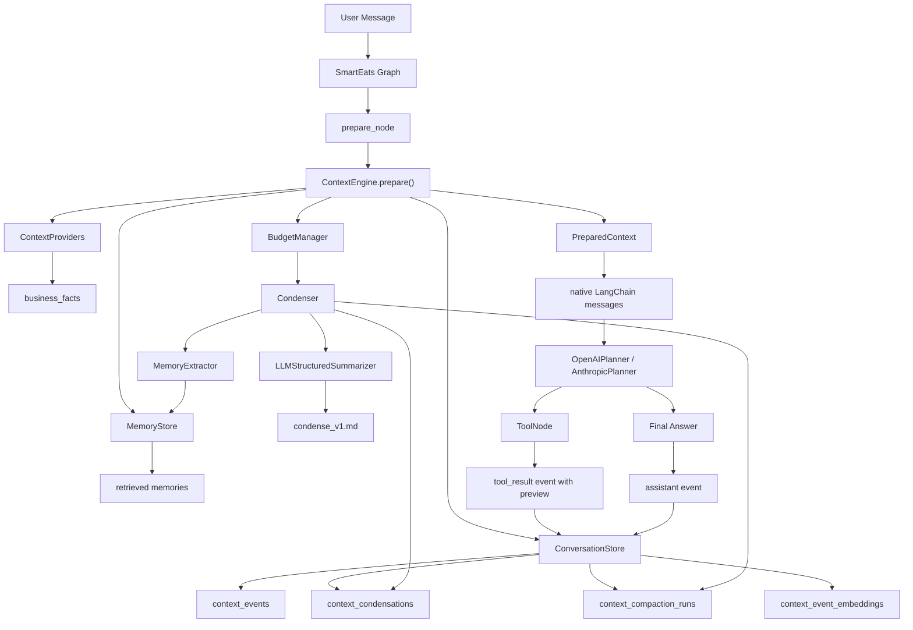
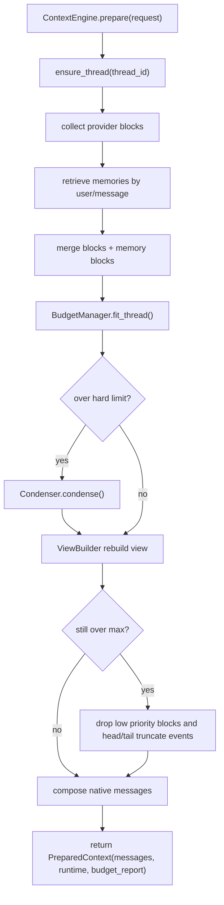
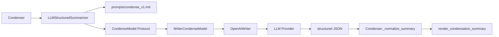
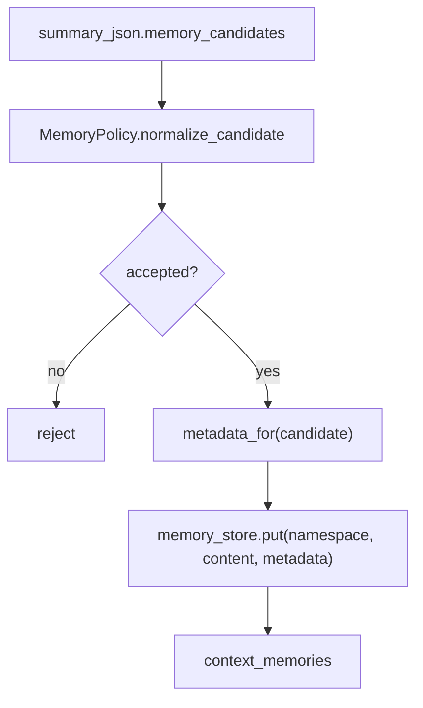
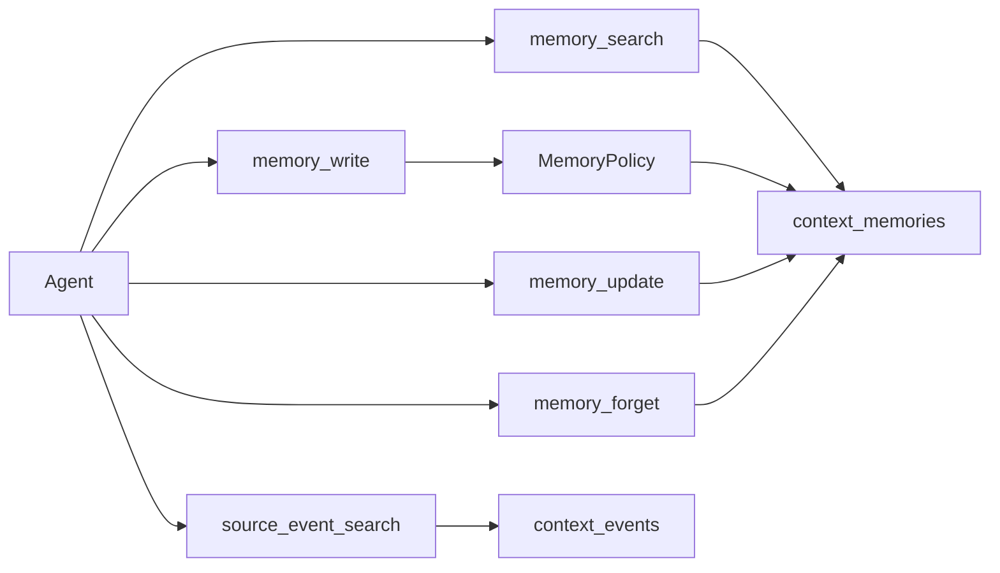
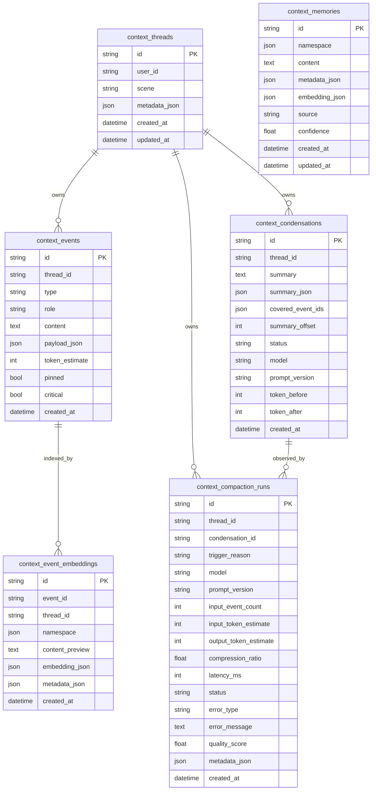
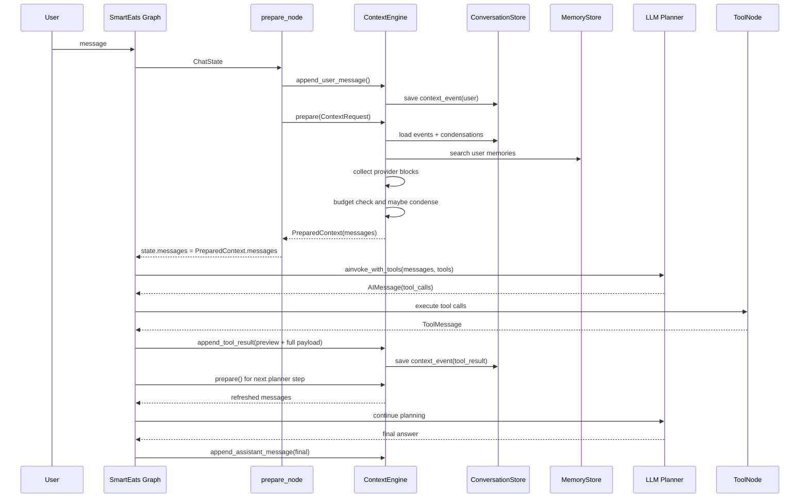
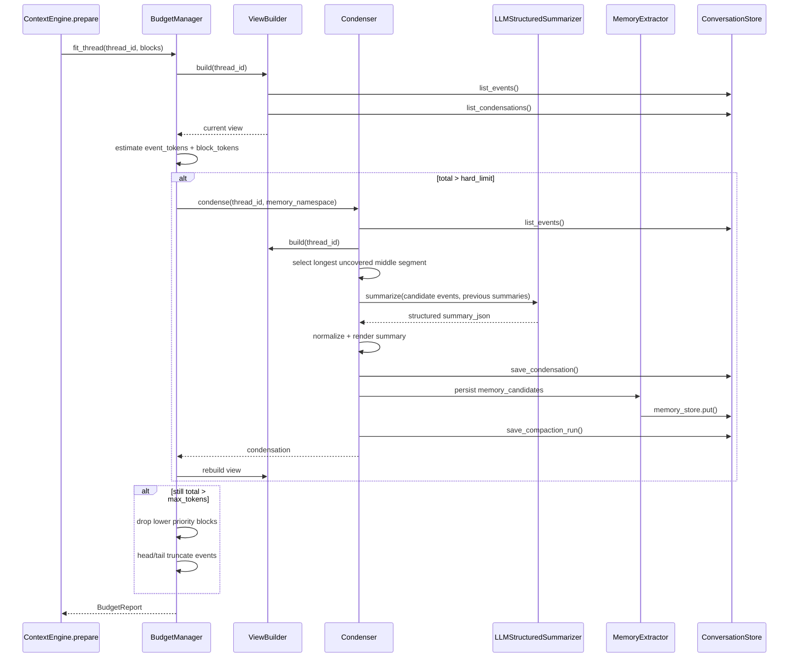

# Context Engine 学习说明文档

本文基于当前 SmartEats 后端已经实现的 Context Engine v2 编写，目标是帮助读者理解这套上下文系统的设计动机、核心机制、数据流、压缩算法、长期记忆、源事件检索、可观测性以及和 SmartEats agent 的接入方式。

适合读者：

- 需要维护 `app/context_engine/` 的后端工程师。
- 需要理解 agent 每次调用大模型时到底发送什么内容的人。
- 需要继续优化长期记忆、上下文压缩、agentic memory tools 的工程师。
- 需要评估这套方案是否可迁移到其他 agent 项目的人。

## 1. 背景与目标

早期 SmartEats 的上下文链路主要依赖 `history`、`memory`、`context_overrides` 拼接。它能工作，但长期运行会暴露几个问题：

- 历史消息、工具结果、业务上下文混在一起，边界不清。
- 工具结果可能很大，直接进入 prompt 容易挤爆上下文窗口。
- 历史压缩如果只做字符串摘要，很难追踪摘要覆盖了哪些原始事件。
- 长期记忆和短期任务状态容易混淆，临时事实可能污染用户长期记忆。
- debug API 如果直接暴露完整上下文，会有 system prompt、完整工具结果、完整 memory 泄露风险。
- 上下文逻辑和 SmartEats 业务耦合，不利于复用到其他 agent。

本次升级的长期目标是把上下文系统抽象为通用 Context Engine：

```text
Context Engine = 原始事件账本 + 结构化压缩 + 长期记忆 + 源事件检索 + token budget + 可观测性 + agentic memory tools
```

核心原则：

- 原始事件永远持久化，summary 只是 view 层替代，不删除源事件。
- LLM 摘要只压缩历史中段，不代表全局最新状态。
- 最新状态由 tail 原文和 runtime context block 承担。
- 工具结果完整落库，但下一轮默认只给模型 preview/facts。
- 长期 memory 只写稳定偏好、长期约束、用户画像、可复用事实。
- 通用层不依赖 SmartEats 业务模型，业务信息通过 provider 注入。

## 2. 代码地图

核心目录：

```text
app/context_engine/
  __init__.py
  types.py                  # 核心 dataclass 类型
  engine.py                 # ContextEngine.prepare 主入口
  providers.py              # ContextProvider 协议
  tokenizer.py              # token 估算
  budget.py                 # token budget 和裁剪/压缩触发
  view.py                   # events + condensations 生成 LLM view
  condenser.py              # 压缩段选择、摘要、memory extraction、metrics
  summarizers.py            # LLM structured summarizer 抽象与实现
  prompts/condense_v1.md    # LLM 压缩提示词
  renderers.py              # condensation summary 渲染为模型可读文本
  memory.py                 # InMemory/PgVector memory store
  memory_extractor.py       # memory candidate policy 和写入
  source_events.py          # 原始事件检索
  agentic_memory.py         # agent 主动管理 memory 的服务
  stores.py                 # InMemory/SQL conversation store

app/agent/
  context_providers.py      # SmartEatsBusinessProvider
  tools/context_memory.py   # memory_search/write/update/forget/source_event_search
  agents/smart_eats.py      # SmartEats 图接入 Context Engine
  graph.py                  # assistant final 回写 context event
  llm_adapters.py           # OpenAIPlanner native messages 接入

app/infra/models/context_engine.py
  ContextThread
  ContextEventModel
  ContextCondensationModel
  ContextMemoryModel
  ContextCompactionRunModel
  ContextEventEmbeddingModel
```

## 3. 总体架构



从图中可以看到，Context Engine 不是一个简单的 prompt 拼接器，而是一个围绕事件账本构建的上下文操作层。

## 4. 核心概念

### 4.1 ContextRequest

`ContextRequest` 是一次 prepare 的输入：

```python
ContextRequest(
    thread_id="session id",
    user_id="user id",
    message="current user message",
    scene="chat",
    system_prompt="rendered system prompt",
    provider="llm provider",
    metadata={},
    context_overrides={},
)
```

关键点：

- `thread_id` 对应一个对话线程。
- `user_id` 用于 memory namespace，当前实现使用 `("user", user_id)`。
- `message` 是当前用户消息。如果该消息已经通过 `append_user_message()` 持久化，prepare 时可以传 `None`，避免重复添加。
- `system_prompt` 由业务层构造，Context Engine 不关心 SmartEats 业务 prompt 的内部结构。

### 4.2 ContextEvent

`ContextEvent` 是短期上下文的最小持久化单位：

```python
ContextEvent(
    id="uuid",
    thread_id="session id",
    type="message | tool_result | ...",
    role="user | assistant | tool | system",
    content="preview or textual content",
    payload={},
    token_estimate=0,
    pinned=False,
    critical=False,
)
```

当前主要事件类型：

- 用户消息：`type="message", role="user"`
- assistant 回复：`type="message", role="assistant"`
- 工具结果：`type="tool_result", role="tool"`
- condensation 是 view 层合成的 synthetic event，不直接作为普通 event 写入 `context_events`。

`pinned` 和 `critical` 用于阻止压缩。后续如果某些事件必须原文保留，例如法律确认、支付确认、用户明确指令，可以将其标记为不可压缩。

### 4.3 ContextBlock

`ContextBlock` 是非对话事件类上下文，例如业务事实、长期记忆、客户端 overrides：

```python
ContextBlock(
    kind="business_facts | memory | client_context | runtime_current_state",
    source="provider name",
    content="rendered text/json",
    priority=85,
    metadata={},
    safe_to_send=True,
)
```

它们最终会被放进 system message 的 `<context_blocks>` 中。

### 4.4 ContextCondensation

`ContextCondensation` 是一次历史中段压缩结果：

```python
ContextCondensation(
    id="uuid",
    thread_id="session id",
    summary="rendered summary text",
    summary_json={...structured schema...},
    covered_event_ids=["event id"],
    summary_offset=2,
    status="completed | failed",
    model="provider/model marker",
    prompt_version="context-condense-v1",
    token_before=1000,
    token_after=200,
)
```

最重要的是 `covered_event_ids`。它告诉 `ViewBuilder`：这些原始 event 在 LLM view 中应该被 summary 替代。

失败的 condensation 不会覆盖事件：

```text
status = failed
covered_event_ids = []
```

这样即使 LLM 摘要失败，也不会丢历史。

## 5. 每次调用大模型时到底发送什么

最终给 planner 的是 `PreparedContext.messages`，即原生消息数组：

```text
SystemMessage:
  system_prompt
  <context_blocks>
    business_facts
    memory
    client_context
  </context_blocks>

SystemMessage:
  <conversation_summary scope="historical_middle_segment">
  ...
  </conversation_summary>

HumanMessage / AIMessage / ToolMessage:
  head raw events
  tail raw events

HumanMessage:
  current user message, if not already persisted
```

更准确地说，conversation view 是：

```text
head 原始事件
+ historical middle condensation summaries
+ tail 原始事件
+ current user message
```

注意：

- summary 只代表历史中段。
- summary 之后的 tail 原始消息更权威。
- `task_state_at_segment_end` 不是全局最新状态。
- 当前任务状态应该由 tail 原文和业务 runtime context 表达。

## 6. prepare 主流程



对应代码入口：

- `ContextEngine.prepare()`：`app/context_engine/engine.py`
- `BudgetManager.fit_thread()`：`app/context_engine/budget.py`
- `Condenser.condense()`：`app/context_engine/condenser.py`
- `ViewBuilder.build()`：`app/context_engine/view.py`

## 7. ViewBuilder 机制

`ViewBuilder` 的职责是把：

```text
raw events + completed condensations
```

转换成：

```text
LLM view events
```

核心规则：

1. 读取线程所有 `context_events`。
2. 读取线程所有 `context_condensations`。
3. 只使用 `status="completed"` 且 `covered_event_ids` 非空的 condensation。
4. 对每个 condensation，在其覆盖的第一个 event 位置插入一个 synthetic `ContextEvent`：

```python
ContextEvent(
    id="summary:first_id:last_id",
    type="condensation",
    role="system",
    content=condensation.summary,
    payload={
        "summary_json": condensation.summary_json,
        "covered_event_ids": ids,
    },
)
```

5. 被覆盖的原始 event 不再出现在 view 中。
6. 未被覆盖的 event 原样保留。

示例：

```text
raw events:
  e1 e2 e3 e4 e5 e6 e7

condensation covers:
  e3 e4 e5

view:
  e1 e2 summary:e3:e5 e6 e7
```

这就是“原始事件不删除，view 层替代”的关键。

## 8. 压缩触发机制

`BudgetManager` 使用 token budget 决定是否压缩和裁剪。

默认参数：

```python
soft_ratio = 0.7
hard_ratio = 0.85
hard_limit = max_tokens * 0.85
```

当前流程：

```text
event_tokens = sum(count_event(view.events))
block_tokens = sum(count_block(blocks))
total = event_tokens + block_tokens

if total > hard_limit:
    condenser.condense(thread_id)
    rebuild view

if total > max_tokens:
    drop lower priority blocks

if still total > max_tokens:
    head/tail truncate events
```

`BudgetReport` 会记录：

```python
BudgetReport(
    total_tokens=...,
    max_tokens=...,
    buckets={
        "system": ...,
        "current_user": ...,
        "recent_messages": ...,
        "tool_preview": ...,
        "memories": ...,
        "business_facts": ...,
        "summaries": ...,
    },
    dropped_blocks=[...],
    dropped_event_ids=[...],
    condensation_triggered=True,
    status="ok | condensed | truncated",
)
```

## 9. 压缩算法

### 9.1 压缩对象选择

压缩只发生在历史中段：

```python
middle = events[keep_head : len(events) - keep_tail]
```

默认：

```python
keep_head = 2
keep_tail = 8
min_events = 3
```

候选事件必须满足：

- 不在已有 `covered_event_ids` 中。
- `pinned=False`。
- `critical=False`。
- `event.type != "condensation"`。

然后从中间段里选择最长的连续未覆盖 segment。

### 9.2 伪代码

```python
def select_candidate(events, covered):
    if len(events) <= keep_head + keep_tail:
        return []

    middle = events[keep_head : len(events) - keep_tail]
    segments = []
    current = []

    for event in middle:
        blocked = (
            event.id in covered
            or event.pinned
            or event.critical
            or event.type == "condensation"
        )
        if blocked:
            if current:
                segments.append(current)
                current = []
            continue
        current.append(event)

    if current:
        segments.append(current)

    return longest(segments)
```

### 9.3 为什么只压缩中段

最终上下文结构是：

```text
head raw
+ middle summary
+ tail raw
+ current user
```

这样做的原因：

- head 通常包含初始目标、角色、任务背景，保留原文价值高。
- tail 包含最新消息、最新工具结果、当前任务状态，必须原文保留。
- middle 往往是已发生的历史过程，适合压缩成 summary。

最重要的是：summary 不负责表达全局最新状态。

## 10. LLM 结构化摘要机制

### 10.1 组件关系



### 10.2 CondenseModel 抽象

`CondenseModel` 是通用模型接口：

```python
class CondenseModel(Protocol):
    async def summarize(
        self,
        *,
        system: str,
        messages: list[dict[str, Any]],
        response_schema: dict[str, Any],
        timeout_seconds: float,
    ) -> dict[str, Any]:
        ...
```

通用层只依赖这个协议，不直接绑定某个供应商。

当前 `WriterCondenseModel` 通过 `OpenAIWriter.stream()` 调用已有 writer 模型，并解析 JSON。

### 10.3 压缩提示词

提示词文件：

```text
app/context_engine/prompts/condense_v1.md
```

核心要求：

- 只总结历史中间片段。
- 不代表完整对话。
- 不代表全局最新状态。
- 后续原始消息比摘要更权威。
- 输出合法 JSON。
- 不输出 Markdown。
- 不保留完整工具原始结果。
- 输出 `memory_candidates` 供长期记忆抽取。

### 10.4 摘要 schema

```json
{
  "segment_summary": "string",
  "user_goals": ["string"],
  "stable_preferences": ["string"],
  "decisions": ["string"],
  "tool_results": ["string"],
  "open_questions_at_segment_end": ["string"],
  "task_state_at_segment_end": ["string"],
  "important_entities": ["string"],
  "do_not_repeat": ["string"],
  "memory_candidates": [
    {
      "kind": "preference|fact|constraint|profile|habit",
      "content": "string",
      "confidence": 0.0,
      "ttl": "none|session|days_30",
      "source_event_ids": ["string"]
    }
  ]
}
```

字段语义：

- `segment_summary`：这段中间历史发生了什么。
- `user_goals`：这段里出现过的用户目标。
- `stable_preferences`：可复用偏好。
- `decisions`：已确定的选择。
- `tool_results`：工具结果结论，不是完整工具 payload。
- `open_questions_at_segment_end`：截至该片段结束仍未解决的问题。
- `task_state_at_segment_end`：截至该片段结束的任务状态，不是全局最新状态。
- `important_entities`：地点、餐厅、菜品、时间、对象等。
- `do_not_repeat`：已经失败或不应重复的动作。
- `memory_candidates`：可能进入长期记忆的候选项。

### 10.5 渲染给模型的 summary

`render_condensation_summary()` 会将 JSON 渲染成：

```text
<conversation_summary scope="historical_middle_segment">
This summary covers older middle events only. Newer raw messages after this summary are authoritative.

Segment summary:
...

Stable preferences:
- ...

Task state at segment end:
- ...
</conversation_summary>
```

这个 scope 标注很重要。它告诉模型：summary 是旧中段，不是当前最新状态。

## 11. 压缩失败策略

LLM 摘要可能失败，例如超时、返回非 JSON、返回空对象、网络异常。

当前策略：

```text
try:
    call summarizer
    normalize summary_json
    status = completed
except Exception:
    summary_json = {"segment_summary": "摘要生成失败：..."}
    status = failed

if status == completed:
    covered_event_ids = candidate ids
else:
    covered_event_ids = []
```

失败时仍保存 condensation 和 compaction run，但不会覆盖原始事件。

这样有两个好处：

- debug 时能看到压缩失败原因。
- view 不会丢掉任何原始历史。

## 12. 长期记忆抽取机制

### 12.1 为什么不能把 summary 全写入 memory

summary 包含很多短期信息，例如：

- 当前路线。
- 当前餐厅搜索结果。
- 当前 open question。
- 当前任务状态。

这些不应该进入长期 memory。长期 memory 应只保存稳定、可复用、未来对用户有帮助的信息。

### 12.2 MemoryPolicy

`MemoryPolicy` 的当前规则：

```python
writable_kinds = {
    "preference",
    "fact",
    "constraint",
    "profile",
    "habit",
}

min_confidence = 0.6
```

候选项会被拒绝的情况：

- 非 dict。
- `kind` 不在允许列表。
- `content` 为空。
- `confidence < 0.6`。
- `ttl == "session"`。

允许写入的示例：

```json
{
  "kind": "preference",
  "content": "用户偏好清淡口味",
  "confidence": 0.92,
  "ttl": "none",
  "source_event_ids": ["event-id"]
}
```

写入 memory 时会附带 metadata：

```json
{
  "kind": "preference",
  "source": "condensation",
  "confidence": 0.92,
  "ttl": "none",
  "source_event_ids": ["event-id"],
  "source_condensation_id": "condensation-id",
  "status": "active"
}
```

### 12.3 MemoryExtractor 流程



## 13. MemoryStore 机制

当前有两个实现：

- `InMemoryVectorMemoryStore`：测试和 SQLite fake 场景使用。
- `PgVectorMemoryStore`：SQL 后端，Postgres 下可用 pgvector 列和索引。

### 13.1 namespace

当前用户长期记忆 namespace：

```python
("user", user_id)
```

这意味着不同用户的 memory 完全隔离。

### 13.2 embedding 与 scoring

当前实现包含两个 embedding 路径：

- `_embed()`：稀疏 token/中文字符向量，用于本地 deterministic scoring。
- `_embed_dense()`：确定性 dense vector，维度 384，用于写入 Postgres `vector(384)` 列。

当前检索仍走 portable 本地 scoring：

```python
score = cosine(_embed(query), _embed(content))
```

Postgres 中已经准备了 `embedding vector(384)` 和 ivfflat index，后续可以将检索替换为原生 pgvector distance。

### 13.3 update/delete

agentic memory tools 需要支持修改和删除。

当前删除不是物理删除，而是 metadata 标记：

```json
{"status": "deleted"}
```

检索时只返回：

```text
status == active
```

## 14. 源事件检索机制

summary 一定会丢细节，所以必须保留原始事件检索能力。

### 14.1 事件写入时同步 embedding 记录

`SqlConversationStore.append_event()` 会写两张表：

```text
context_events
context_event_embeddings
```

`context_event_embeddings` 保存：

- event_id
- thread_id
- namespace
- content_preview
- embedding_json
- metadata_json
- Postgres vector column

### 14.2 SourceEventRetriever

`SourceEventRetriever.search_events()` 当前读取原始 events 并做本地 scoring。

检索逻辑：

```text
1. resolve thread_id
2. list raw events
3. apply metadata_filter
4. calculate score
5. if query is substring of content, boost score
6. filter weak matches
7. sort by score
8. return top_k SourceEventHit
```

返回的是 preview，不是完整 payload：

```python
SourceEventHit(
    event_id="...",
    thread_id="...",
    content_preview="first 500 chars",
    score=0.8,
    metadata={...},
)
```

这样既能找回源事件，又避免默认泄露完整工具结果。

## 15. Agentic Memory Tools

新增工具：

```text
memory_search
memory_write
memory_update
memory_forget
source_event_search
```

### 15.1 工具职责



工具说明：

- `memory_search`：当前任务需要用户长期偏好时主动检索。
- `memory_write`：用户明确表达长期偏好/约束时写入。
- `memory_update`：用户更正旧记忆时更新。
- `memory_forget`：用户要求忘记时删除。
- `source_event_search`：summary 不够详细时检索源事件。

### 15.2 安全边界

工具写 memory 必须经过 `MemoryPolicy`：

- 只允许明确的长期事实、偏好、约束。
- 不允许写 session 临时状态。
- 不允许写低置信度内容。
- 删除使用 soft delete，便于审计。

后续可继续增强：

- 敏感信息分类。
- 用户确认机制。
- memory conflict resolution。
- memory TTL 清理任务。

## 16. 可观测性机制

每次压缩都会写 `context_compaction_runs`。

字段包括：

```text
id
thread_id
condensation_id
trigger_reason
model
prompt_version
input_event_count
input_token_estimate
output_token_estimate
compression_ratio
latency_ms
status
error_type
error_message
quality_score
metadata_json
created_at
```

### 16.1 compression_ratio

```python
compression_ratio = output_token_estimate / input_token_estimate
```

越低表示压缩越强，但过低可能丢信息。

### 16.2 quality_score

当前是规则评分：

```text
quality_score = filled_schema_fields / total_schema_fields
```

它不是语义质量的最终判断，只是一个可观测起点。

后续可以升级为：

- LLM judge。
- 源事件事实一致性校验。
- tail 冲突检测。
- 用户反馈回传。

### 16.3 Debug Snapshot

`ContextService.build_debug_snapshot()` 返回脱敏视图：

```json
{
  "thread_id": "...",
  "event_count": 3,
  "events": [
    {
      "id": "...",
      "type": "message",
      "role": "user",
      "content_preview": "...",
      "token_estimate": 12
    }
  ],
  "compaction_runs": [
    {
      "status": "completed",
      "compression_ratio": 0.23,
      "quality_score": 0.66
    }
  ]
}
```

不会返回：

- system prompt
- 完整 memory
- 完整 tool result payload
- 完整 source event payload

## 17. 数据库架构



Postgres 初始化还会执行：

```sql
CREATE EXTENSION IF NOT EXISTS vector;
ALTER TABLE context_memories ADD COLUMN IF NOT EXISTS embedding vector(384);
CREATE INDEX IF NOT EXISTS ix_context_memories_embedding
  ON context_memories USING ivfflat (embedding vector_cosine_ops);

ALTER TABLE context_event_embeddings ADD COLUMN IF NOT EXISTS embedding vector(384);
CREATE INDEX IF NOT EXISTS ix_context_event_embeddings_embedding
  ON context_event_embeddings USING ivfflat (embedding vector_cosine_ops);
```

SQLite 测试环境使用 JSON embedding 和 fake/local scoring。

## 18. SmartEats 接入时序



几个兼容细节：

- 如果 `db is None` 或测试里传入 mock db，SmartEats 会回退到旧 `_refresh_observation_context()`。
- 只有 `state.context["prepared_context"] is True` 时，agent node 才会使用 `state["messages"]` 作为新 native context。
- 旧 fallback 链路继续使用 `[SystemMessage, HumanMessage]`，避免破坏已有测试和旧逻辑。

## 19. LLM 调用适配

`OpenAIPlanner.ainvoke_with_tools()` 支持两种路径：

```text
简单 system/user 两条消息:
  走 plan_tool_calls(system, user, tools)
  兼容旧测试和旧调用方式

PreparedContext 多消息:
  走 plan_native_messages_with_tools(messages, tools)
  保留 System/Human/AI/ToolMessage 结构
```

这样既能引入 native messages，又不会破坏旧单元测试和旧 fallback 路径。

## 20. 工具结果处理

工具结果处理的原则：

```text
完整工具结果写 event payload
给模型的 content 默认是 result_preview
SSE tool_call 事件也只返回 result_preview
```

在 `SmartEats._apply_official_tool_postprocess()` 中：

```text
tool message -> decode result
result_preview = _build_result_preview(...)
history.save_tool_message(...)
context_engine.append_tool_result(
    content=json.dumps(result_preview),
    payload={"args": args, "result": result},
    preview=result_preview
)
```

这样模型下一轮能看到关键事实，但不会被完整工具 payload 挤爆上下文。

## 21. 完整压缩时序



## 22. Head/Tail 裁剪兜底

当 LLM condensation 后仍超限时，`BudgetManager` 会做 deterministic head/tail truncation。

当前策略：

```python
head_count = min(2, len(events))
kept = events[:head_count]

for event in reversed(events[head_count:]):
    if used + event_cost <= token_budget:
        insert after head
    else:
        dropped.append(event.id)
```

含义：

- 先保留开头 2 条事件。
- 从尾部往前尽可能保留最近事件。
- 中间放不下的事件进入 `dropped_event_ids`。
- `_compose_messages()` 会跳过这些 dropped events。

这个兜底不追求语义完美，只保证永不超窗。

## 23. 与业界优秀 Agent 方案的对应关系

这套方案对应了主流 agent memory/context 系统里的几个关键能力：

```text
短期上下文:
  recent raw messages + historical summaries

长期记忆:
  memory extraction + vector retrieval

可追溯性:
  source events preserved + covered_event_ids

可控压缩:
  token budget + hard limit + fallback truncation

可观测:
  compaction runs + compression ratio + quality score

agentic memory:
  memory_search/write/update/forget + source_event_search
```

和更完整的 agentic memory 系统相比，当前仍有可继续演进的点：

- 还没有 LLM judge 做 hallucination check。
- pgvector 原生相似度查询还未替换 portable scoring。
- memory conflict resolution 仍比较基础。
- sensitive memory policy 还需要增强。
- memory TTL 清理任务还未实现。
- source event retrieval 目前默认返回 preview，必要时可增加更严格的权限控制读取完整 payload。

## 24. 当前测试覆盖

新增/相关测试位于：

```text
app/tests/test_context_engine.py
app/tests/test_smart_eats_graph_builder.py
app/tests/test_smart_eats_tool_postprocess.py
app/tests/test_tools_registry_langchain.py
```

覆盖点：

- condensation view 替换 covered events。
- 已覆盖事件不会重复压缩。
- budget 超限触发 condensation。
- native messages 输出。
- structured condensation 渲染 scope。
- compaction metrics 写入。
- failed condensation 不覆盖事件。
- memory candidate 写入策略。
- source event 检索已被 summary 覆盖的原始事件。
- agentic memory write/search/update/forget。
- SmartEats fallback 兼容。
- 工具后处理不回归。

最近完整测试结果：

```text
python -m pytest app/tests -q
179 passed
```

## 25. 常见问题

### 25.1 history 和 condensation 有什么区别

`history` 是传统意义上的对话消息列表，通常是直接给模型或简单压缩后给模型。

`condensation` 是 Context Engine 的持久化压缩对象：

- 它记录覆盖了哪些 event。
- 它有结构化 `summary_json`。
- 它有 `status`。
- 它能被 `ViewBuilder` 用来替代原始事件。
- 它不删除原始事件。
- 它有对应 compaction metrics。

### 25.2 压缩摘要是不是全局最新状态

不是。

摘要只覆盖历史中段。最新状态由：

- tail 原始事件
- current user message
- business/runtime context blocks

共同表达。

### 25.3 为什么工具结果不完整给模型

完整工具结果可能很大，也可能包含不需要暴露给模型的字段。当前策略是：

- 完整结果写入 event payload。
- 模型只看 preview/facts。
- 需要细节时通过 `source_event_search` 找回源事件 preview。

### 25.4 为什么 failed condensation 也要保存

因为它是可观测性的一部分。保存失败记录可以回答：

- 哪次压缩失败了。
- 为什么失败。
- 失败时输入规模多大。
- 是否影响用户请求。

但 failed condensation 不覆盖 event，所以不会丢上下文。

### 25.5 为什么 memory delete 是软删除

软删除便于审计和避免误删恢复困难。检索默认只返回 `status=active` 的 memory。

如果未来有合规要求，可以增加物理删除接口。

## 26. 后续优化建议

优先级从高到低：

1. 使用真实 embedding 模型替换 deterministic embedding。
2. 将 memory/source event 检索切到原生 pgvector distance SQL。
3. 增加 LLM judge，评估 summary 是否遗漏关键事实或产生幻觉。
4. 增加 memory conflict resolution，例如新偏好 supersede 旧偏好。
5. 增加敏感 memory policy，例如健康、位置、身份信息需要更严格授权。
6. 增加 TTL cleanup job，清理过期 memory。
7. 增加 full source event fetch 的权限门，只在明确需要时读取完整 payload。
8. 增加 context replay/eval，用长对话回归测试 summary 是否影响 final_json。
9. 增加 dashboard 展示 compaction runs、compression ratio、memory write count。
10. 将 Context Engine 包装为更独立的库接口，供非 SmartEats agent 复用。

## 27. 一句话总结

当前 Context Engine v2 的本质是：

```text
用事件账本保证可追溯，用结构化摘要压缩历史中段，用 tail 原文保证最新状态，用长期 memory 保留稳定事实，用源事件检索弥补摘要丢失，用 compaction metrics 让压缩质量可观测，用 agentic memory tools 让 agent 能主动管理记忆。
```

