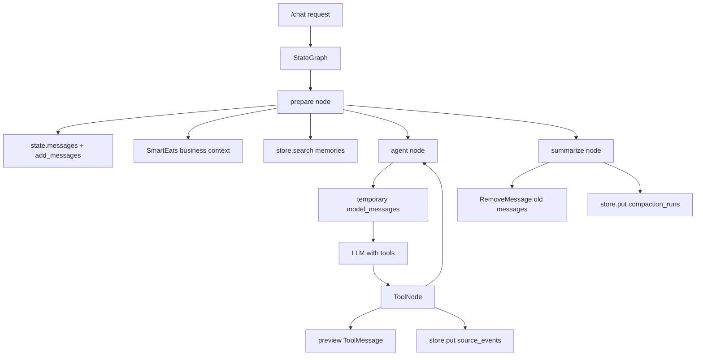
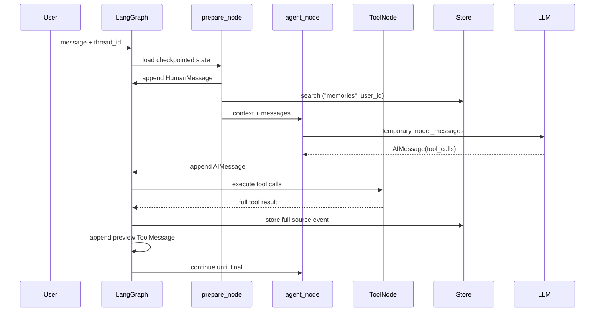

# LangGraph-Native Context Runtime 学习说明

SmartEats 当前主链路采用 LangGraph-native 上下文管理：短期上下文以 `StateGraph` state 中的 `messages` 为唯一真相源，持久化由 checkpointer 按 `thread_id` 管理，长期记忆、源事件和压缩观测数据进入 LangGraph store。

## 核心原则

- `messages: Annotated[list[AnyMessage], add_messages]` 是唯一短期对话历史。
- system prompt、业务事实、长期记忆只在调用模型前临时注入，不写入 `messages`。
- 工具完整结果不进 prompt；下一轮只追加 preview `ToolMessage`。
- 长期记忆使用 store namespace：`("memories", user_id)`。
- 工具源事件使用 store namespace：`("source_events", thread_id)`。
- 压缩质量记录使用 store namespace：`("compaction_runs", thread_id)`。
- 生产环境使用持久化 store，例如 `LANGGRAPH_STORE_BACKEND=postgres`；`memory` store 只用于测试或本地 scratch session。

## 架构图

## 每次模型调用收到什么

`agent_node` 调用 `build_model_messages()` 构造临时输入：

1. `SystemMessage(system_prompt + business context + retrieved memories)`
2. 可选 `SystemMessage(<conversation_summary>...)`
3. `state["messages"]` 中保留的原生 `HumanMessage` / `AIMessage` / preview `ToolMessage`

这些临时 `SystemMessage` 不会写回 LangGraph state。模型返回的 `AIMessage` 会通过 `add_messages` 追加到 `state["messages"]`。

## 时序图

## 压缩机制

触发条件由 `should_summarize()` 控制：

- `len(messages) >= CHAT_COMPACT_MIN_MESSAGES`
- 估算 token 达到 `LLM_MODEL_CONTEXT_SIZE * CHAT_COMPACT_TRIGGER_RATIO`

触发后 `summarize_node`：

1. 选择旧消息段，保留最近消息和最新工具调用片段。
2. 使用已有 summary + 待压缩消息生成新 summary。
3. 返回 `RemoveMessage(...)` 删除旧消息。
4. 把 `token_before/token_after/compression_ratio/removed_message_count` 写入 `("compaction_runs", thread_id)`。

摘要只代表被删除的旧消息段；最近 `messages` 永远比 summary 更权威。

## 长期记忆与工具

`memory_search/write/update/forget` 已改为 LangGraph store：

- 写入：`("memories", user_id)`。
- 搜索：store `search(namespace, query=...)`。
- 更新：同 namespace 下按 memory id 覆盖。
- 删除：同 namespace 下按 memory id 删除。

工具运行时通过 `runtime_context["langgraph_store"]` 获得 store，不再依赖 `AsyncSession` 或 `context_memories`。

## Debug 与安全

`ContextService.build_debug_snapshot()` 不再读取旧 `context_events` 表，并通过 `langgraph_context` 字段暴露调试信息。它只返回：

- source event preview
- compaction budget/status
- namespace metadata

不会返回完整 system prompt、完整工具 payload 或完整 memory 内容。
