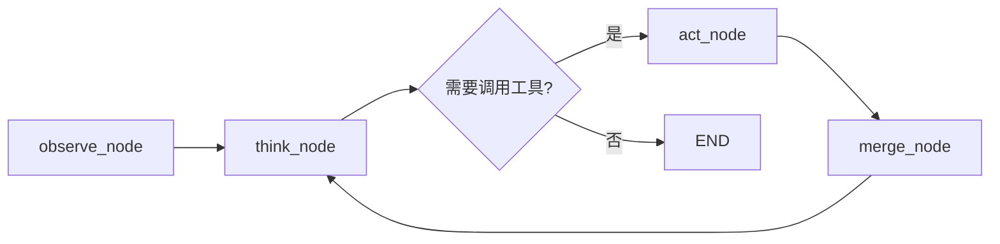

# Smart-Eats-AI-Backend 项目梳理

## 📌 项目概述

这是一个 **AI 智能美食推荐系统后端**，使用 **FastAPI + LangGraph + SSE** 构建。项目提供了一个基于 LLM 的对话式 AI Agent，能够为用户提供餐厅推荐、食谱搜索、路线规划等智能服务。

---

## 🏗️ 技术栈

| 类别 | 技术 |
|------|------|
| **Web 框架** | FastAPI |
| **AI Agent 框架** | LangGraph |
| **LLM 支持** | OpenAI / DeepSeek / Qwen（通义千问） |
| **数据库** | SQLAlchemy + SQLite (dev) / PostgreSQL (prod) |
| **缓存/消息** | Redis |
| **实时通信** | SSE (Server-Sent Events) |
| **向量搜索** | FAISS + Sentence-Transformers |
| **MCP 适配** | langchain-mcp-adapters |

---

## 📁 目录结构

```
smart-eats-ai-bakend/
├── app/
│   ├── main.py                 # FastAPI 应用入口
│   ├── agent/                  # LangGraph Agent 核心模块
│   │   ├── graph.py            # Agent 图定义（核心逻辑）
│   │   ├── agents/             # 具体 Agent 实现
│   │   │   ├── base.py         # Agent 基类
│   │   │   └── smart_eats.py   # SmartEats 主 Agent
│   │   ├── tools/              # Agent 可调用的工具函数
│   │   ├── prompts/            # 系统提示词模板
│   │   ├── rag/                # RAG 检索增强生成模块
│   │   ├── llm_adapters.py     # LLM 适配器（多模型支持）
│   │   ├── state.py            # Agent 状态定义
│   │   ├── schemas.py          # 数据结构定义
│   │   └── ...
│   ├── api/                    # HTTP API 层
│   │   ├── deps.py             # 依赖注入
│   │   └── v1/                 # V1 版本 API
│   │       ├── router.py       # 路由注册
│   │       ├── auth.py         # 认证接口
│   │       ├── chat.py         # 聊天/对话接口（SSE 流式）
│   │       ├── fridge.py       # 冰箱管理接口
│   │       ├── recipes.py      # 食谱接口
│   │       ├── restaurants.py  # 餐厅接口
│   │       ├── preferences.py  # 用户偏好
│   │       └── ...
│   ├── domain/                 # 领域模型
│   │   ├── auth/               # 认证领域
│   │   ├── chat/               # 聊天领域
│   │   ├── fridge/             # 冰箱领域
│   │   ├── recipe/             # 食谱领域
│   │   ├── restaurant/         # 餐厅领域
│   │   ├── preference/         # 用户偏好领域
│   │   └── ...
│   ├── infra/                  # 基础设施层
│   │   ├── db.py               # 数据库连接
│   │   ├── redis.py            # Redis 连接
│   │   ├── models/             # ORM 模型
│   │   ├── external/           # 外部服务集成
│   │   └── mcp/                # MCP 工具服务
│   ├── common/                 # 公共模块
│   │   ├── config.py           # 配置管理
│   │   ├── errors.py           # 错误处理
│   │   └── logging.py          # 日志配置
│   ├── tasks/                  # 后台任务
│   ├── tests/                  # 测试代码
│   └── static/                 # 静态文件（前端测试页）
├── scripts/                    # 脚本工具
├── requirements.txt            # Python 依赖
├── docker-compose.yml          # Docker 编排
└── mcp_servers.json            # MCP 服务配置
```

---

## 🤖 Agent 架构

项目核心是一个基于 **LangGraph** 的 AI Agent，采用 **Observe-Think-Act-Merge** 循环模式：



### 核心节点说明

| 节点 | 功能 |
|------|------|
| **observe_node** | 收集上下文（历史摘要、用户记忆、用户偏好等） |
| **think_node** | 调用 LLM 思考，决定下一步动作（回复或调用工具） |
| **act_node** | 执行工具调用（餐厅搜索、食谱查询等） |
| **merge_node** | 合并工具执行结果，更新状态 |

---

## 🛠️ 可用工具 (Tools)

Agent 通过工具与外部服务交互：

| 工具 | 功能 |
|------|------|
| `search_restaurants` | 搜索附近餐厅 |
| `search_recipes` | 搜索食谱 |
| `rag_search_recipes` | RAG 语义食谱搜索 |
| `get_fridge_items` | 获取冰箱食材 |
| `get_weather` | 获取天气信息 |
| `geocode_location` | 地理编码 |
| `get_ip_location` | 根据 IP 获取位置 |
| `plan_route` | 路线规划 |
| `get_user_info` | 获取用户信息 |

---

## 🔌 API 接口

### 核心聊天接口

- `POST /api/v1/chat/sessions` - 创建会话
- `GET /api/v1/chat/sessions` - 会话列表
- `POST /api/v1/chat/sessions/{session_id}/stream` - **SSE 流式对话**
- `POST /api/v1/chat/sessions/{session_id}/stop` - 停止生成
- `GET /api/v1/chat/sessions/{session_id}/messages` - 历史消息

### 其他接口

- `/api/v1/auth/*` - 认证相关
- `/api/v1/fridge/*` - 冰箱管理
- `/api/v1/preferences/*` - 用户偏好
- `/api/v1/restaurants/*` - 餐厅查询

---

## 🗃️ 数据模型

| 模型 | 说明 |
|------|------|
| `User` | 用户 |
| `ChatSession` | 对话会话 |
| `ChatMessage` | 聊天消息 |
| `FridgeItem` | 冰箱食材 |
| `Recipe` | 食谱 |
| `Restaurant` | 餐厅 |
| `UserPreference` | 用户偏好 |
| `Memory` | 长期记忆 |
| `Context` | 上下文 |

---

## 🚀 启动方式

```bash
# 1. 安装依赖
pip install -r requirements.txt

# 2. 配置环境变量
cp .env.example .env
# 编辑 .env 填入 API Key 等配置

# 3. 启动 Redis
brew services start redis

# 4. 启动服务
uvicorn app.main:app --reload
```

访问 `http://127.0.0.1:8000/` 即可使用内置的测试前端页面。

---

## 📊 架构亮点

1. **多 LLM 提供商支持** - 通过 `llm_adapters.py` 支持 OpenAI、DeepSeek、通义千问
2. **SSE 实时流式响应** - 用户体验流畅
3. **LangGraph 状态机** - Agent 逻辑清晰可控
4. **RAG 语义搜索** - FAISS + Sentence-Transformers 增强食谱检索
5. **历史压缩** - 自动压缩历史对话，节省 Token
6. **MCP 工具集成** - 支持外部 MCP 服务扩展
