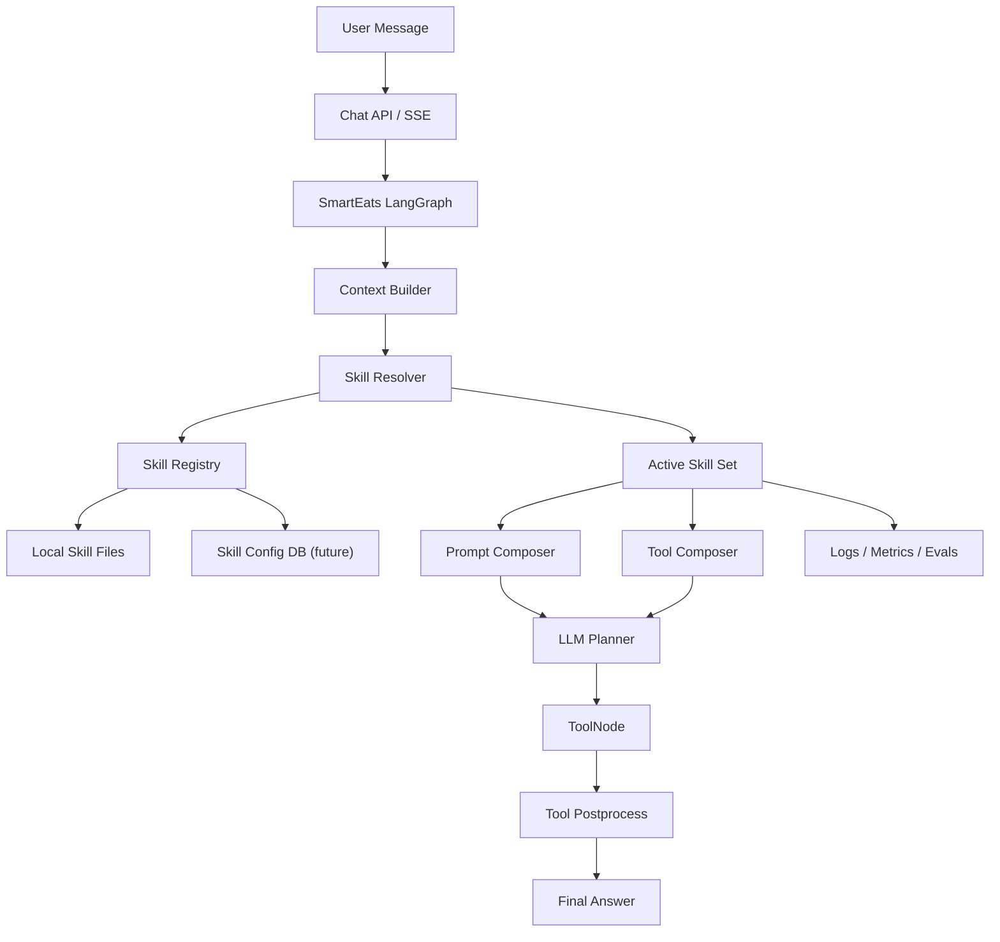

# Smart-Eats Agent Skill Framework 设计

## 1. 文档目标

本文档设计 Smart-Eats Agent 的运行时 Skill Framework。

这里的 skill 不是 Codex、Claude Code 或 Spec Kit 使用的开发助手 skill，而是 Smart-Eats 产品内的 agent 能力模块。它用于让 Smart-Eats 在运行时按场景加载不同能力，例如在家做饭、附近餐厅、营养控制、路线规划、多人决策等。

本文档回答：

- skill 在 Smart-Eats 运行时中的定位是什么
- 框架层面应该拆成哪些模块
- skill 如何被定义、加载、激活和注入
- skill 如何影响 prompt、tools、context 和观测日志
- 第一阶段如何落地，后续如何演进

本文档不直接给出完整实现代码，但会明确目标目录、核心模型、运行链路和接入点。

---

## 2. 背景与现状

当前 Smart-Eats 是一个基于 FastAPI、LangGraph、LLM function calling 和工具注册表的 agent 项目。

与 skill framework 最相关的现有模块包括：

- 对话运行入口： [app/agent/graph.py](app/agent/graph.py)
- Smart-Eats 专属 agent： [app/agent/agents/smart_eats.py](app/agent/agents/smart_eats.py)
- Agent 状态： [app/agent/state.py](app/agent/state.py)
- 工具注册表： [app/agent/tools_registry.py](app/agent/tools_registry.py)
- 工具实现： [app/agent/tools/](app/agent/tools/)
- 系统提示词： [app/agent/prompts/system.md](app/agent/prompts/system.md)
- MCP 客户端： [app/infra/mcp/](app/infra/mcp/)

当前架构已经具备：

- 固定 Smart-Eats agent graph
- 固定系统提示词
- 固定工具 allowlist
- 基于 context 的运行时状态注入
- 基于 MCP 的外部工具调用能力
- 日志、replay、metrics 和测试基础

但当前还没有：

- 独立的 skill 定义格式
- skill 加载、校验、缓存机制
- 根据场景或用户输入选择 skill 的 resolver
- skill prompt 注入机制
- skill 级别工具授权
- skill 级别观测日志和评测维度

因此，当前 agent 能力更偏“内置硬编码”，后续如果继续扩展，会出现：

- prompt 越来越长且难维护
- 工具暴露策略和业务场景耦合过重
- 新能力难以独立测试和灰度
- 很难知道某次回答到底受哪个能力模块影响
- 不能按用户、场景、版本启停能力

---

## 3. 设计目标

## 3.1 把 skill 作为 agent 能力包

Smart-Eats 的 skill 应定义为：

```text
Skill = Metadata + Activation Policy + Instructions + Tool Policy + Context Policy + Safety Policy
```

它不是单纯的 prompt 片段，也不是任意代码插件，而是一个声明式能力包。

一个 skill 可以表达：

- 什么时候该激活
- 激活后给 LLM 哪些行为规则
- 激活后允许使用哪些工具
- 需要哪些上下文
- 是否有额外安全约束
- 如何记录和评测

## 3.2 保持现有 LangGraph 主链路稳定

第一阶段不重写 graph，不改变核心 observe、think、tools、postprocess、finalize 流程。

Skill Framework 作为中间层接入：

```text
Context Builder
  -> Skill Resolver
  -> Prompt Composer
  -> Tool Composer
  -> Planner
```

也就是说，skill framework 不替代现有 agent，而是为现有 agent 提供动态能力配置。

## 3.3 先声明式，后插件式

第一阶段只支持声明式 skill：

- 本地 manifest
- markdown instructions
- 内置工具 allowlist
- 规则式激活

暂不支持：

- skill 内执行任意 Python 代码
- 在线安装第三方 skill
- skill 自带未审计外部工具
- skill 修改 LangGraph 拓扑

这样可以减少安全风险，也更适合当前 Smart-Eats 的代码结构。

---

## 4. 非目标

第一阶段不解决以下问题：

- 不做 skill marketplace
- 不做第三方 skill 在线安装
- 不允许 skill 直接访问文件系统或数据库
- 不允许 skill 动态注册未审核工具
- 不让 skill 覆盖全局安全规则
- 不把 MCP server 自动视为 skill

MCP 是外部工具接入协议，skill 是 agent 能力组织方式。两者可以绑定，但不是同一个概念。

---

## 5. 总体架构

目标架构如下：



新增的 Skill Framework 由六个核心模块组成：

```text
app/agent/skills/
  models.py        # Pydantic / dataclass 模型
  loader.py        # 本地文件加载和校验
  registry.py      # skill 注册表与缓存
  resolver.py      # skill 激活决策
  prompt.py        # skill prompt 拼装
  tools.py         # skill tool allowlist 合成
  policy.py        # 安全和冲突策略
  runtime.py       # 对外统一入口
```

---

## 6. 核心概念

## 6.1 SkillSpec

`SkillSpec` 是单个 skill 的运行时表示。

建议字段：

```python
class SkillSpec(BaseModel):
    id: str
    name: str
    version: str
    description: str
    enabled: bool = True
    priority: int = 50
    activation: SkillActivationPolicy
    instructions: SkillInstructions
    tools: SkillToolPolicy
    context: SkillContextPolicy | None = None
    safety: SkillSafetyPolicy = SkillSafetyPolicy()
```

字段说明：

| 字段 | 作用 |
|------|------|
| `id` | 稳定唯一标识，例如 `home_chef` |
| `name` | 展示名称 |
| `version` | skill 版本，用于日志和评测 |
| `description` | 给系统和开发者看的能力说明 |
| `enabled` | 是否启用 |
| `priority` | 多 skill 激活时的排序 |
| `activation` | 激活条件 |
| `instructions` | prompt 注入内容 |
| `tools` | 工具授权策略 |
| `context` | 上下文依赖声明 |
| `safety` | 安全限制 |

## 6.2 ActiveSkillSet

`ActiveSkillSet` 表示一轮对话中实际启用的 skill 集合。

建议字段：

```python
class ActiveSkillSet(BaseModel):
    skills: list[SkillSpec]
    activation_reasons: dict[str, list[str]]
    prompt_blocks: list[SkillPromptBlock]
    allowed_tools: list[str]
    context_extensions: dict[str, Any]
    warnings: list[str] = []
```

它是 Skill Resolver、Prompt Composer 和 Tool Composer 之间的核心数据结构。

## 6.3 SkillRuntimeResult

`SkillRuntimeResult` 是 Skill Framework 对 Smart-Eats 主 agent 暴露的统一结果。

建议字段：

```python
class SkillRuntimeResult(BaseModel):
    active_skills: list[ActiveSkillInfo]
    system_prompt_addendum: str
    allowed_tools: list[str]
    context: dict[str, Any]
    diagnostics: SkillDiagnostics
```

`smart_eats.py` 不应该关心 skill 文件如何加载，也不应该自己拼 skill prompt。它只消费这个 runtime result。

---

## 7. Skill 文件格式

建议把产品运行时 skill 放在独立目录，避免和当前开发助手技能混淆。

```text
agent_skills/
  home_chef/
    skill.yaml
    instructions.md
    examples.yaml
  restaurant_finder/
    skill.yaml
    instructions.md
  nutrition_guard/
    skill.yaml
    instructions.md
```

不建议复用当前根目录 `skills/` 作为运行时目录，因为当前 `skills/` 更像开发辅助工具目录，里面的 `openspec`、`spec-kit` 不应该注入到产品 agent。

## 7.1 skill.yaml

示例：

```yaml
id: home_chef
name: Home Chef
version: 1.0.0
description: Help users cook with available ingredients.
enabled: true
priority: 80

activation:
  scenes:
    - chat
    - home_chef
  intents:
    - cook_home
  keywords:
    - 做饭
    - 菜谱
    - 冰箱
    - 食材
    - 家里有什么
  min_score: 1

instructions:
  file: instructions.md
  max_chars: 3000

tools:
  allow:
    - get_fridge_items
    - rag_search_recipes
    - search_recipes
  require_global_allowlist: true

context:
  read:
    - user_message
    - history
    - fridge_items
    - memories
  write:
    - active_skills

safety:
  can_override_global_rules: false
  allow_external_tools: false
  max_tool_calls_per_turn: 3
```

## 7.2 instructions.md

示例：

```markdown
# Home Chef Skill

当用户表达“在家做饭”“用已有食材做菜”“不知道冰箱里的东西怎么搭配”时，使用本 skill。

行为规则：

- 优先使用用户已有食材，不要默认用户愿意采购很多额外材料。
- 如果冰箱信息未知，优先调用 `get_fridge_items`。
- 如果需要菜谱检索，优先调用 `rag_search_recipes`。
- 若没有命中菜谱，可以给出简单、可执行的家常做法。
- 用户确认某道菜后，不要继续推荐其他菜，直接给做法。
```

## 7.3 examples.yaml

`examples.yaml` 第一阶段可选，后续可以用于 resolver 评估和 few-shot 行为校准。

```yaml
positive:
  - message: "冰箱里有鸡蛋和番茄，能做什么？"
    reason: "明确在家做饭，且涉及食材"
  - message: "今晚想自己做点清淡的"
    reason: "在家做饭意图"

negative:
  - message: "附近有什么好吃的？"
    reason: "外出就餐，不应激活 home_chef"
```

---

## 8. 激活策略

Skill Resolver 负责判断本轮对话激活哪些 skill。

## 8.1 输入

```text
SmartEatsState
runtime context
enabled skills
global policy
optional forced skill ids
```

关键字段包括：

- `scene`
- `message`
- `history`
- `intent`
- `intent_slots`
- `context_overrides`
- `user_id`
- `agent_type`

## 8.2 输出

```text
ActiveSkillSet
```

其中应包含：

- 激活的 skill
- 每个 skill 的激活原因
- 排序后的 prompt block
- 合并后的工具 allowlist
- warnings 或冲突信息

## 8.3 MVP 激活方式

第一阶段采用规则式激活：

| 条件 | 示例 |
|------|------|
| `scene` 命中 | `scene == home_chef` |
| `intent` 命中 | `intent == cook_home` |
| 关键词命中 | 用户消息包含“冰箱”“做饭”“附近”“路线” |
| 强制激活 | API 或 context 指定 `skill_ids` |

打分方式建议简单可解释：

```text
scene match      +3
intent match     +3
keyword match    +1 each
forced skill     +100
disabled skill   excluded
```

当分数大于等于 `min_score` 时激活。

## 8.4 后续激活方式

第二阶段可以引入 LLM-based skill router：

- 输入用户消息和 skill 描述
- 输出候选 skill ids 和理由
- 只作为规则式 resolver 的补充
- 对低置信度或冲突场景启用

不建议第一阶段直接依赖 LLM router，否则可解释性和测试稳定性会较差。

---

## 9. Prompt 注入设计

Skill prompt 注入由 `PromptComposer` 负责。

## 9.1 拼装顺序

建议 system prompt 顺序：

```text
Base SmartEats System Prompt
Global Safety Rules
Core Workflow Rules
Active Skill Instructions
Runtime Context
```

当前 `smart_system_prompt()` 已经负责读取 [app/agent/prompts/system.md](app/agent/prompts/system.md) 并注入 runtime context。改造后应变成：

```text
base_prompt = load system.md
skill_prompt = prompt_composer.compose(active_skills)
context_json = runtime context
final_system = base_prompt + skill_prompt + runtime context
```

## 9.2 注入格式

建议固定格式：

```markdown
## Active Skills（系统选择的能力模块）

以下 skill 由系统根据场景和用户输入激活。它们只能补充 SmartEats 的核心规则，不能覆盖全局安全规则。

### Skill: home_chef@1.0.0

Activation reasons:
- keyword: 冰箱
- intent: cook_home

Instructions:
...
```

## 9.3 安全要求

PromptComposer 必须保证：

- skill instructions 有最大长度限制
- skill 不能覆盖全局红线
- skill 内容不能放在用户输入区
- active skill 的 ID 和版本进入 context
- 超过 prompt 限制时按 priority 截断

多 skill 同时激活时，按 `priority` 从高到低排序。

---

## 10. Tool 合成设计

当前工具暴露主要由 `agent_config.tool_names` 和 [app/agent/tools_registry.py](app/agent/tools_registry.py) 控制。

加入 skill 后，应改成：

```text
final_allowed_tools = base_tools + tools_allowed_by_active_skills
```

但必须经过全局策略过滤。

## 10.1 ToolComposer 输入

```python
class ToolComposerInput(BaseModel):
    base_tools: list[str]
    active_skills: list[SkillSpec]
    global_allowlist: list[str]
    scene: str
    user_id: str | None
```

## 10.2 ToolComposer 输出

```python
class ToolComposerOutput(BaseModel):
    allowed_tools: list[str]
    denied_tools: dict[str, str]
    tool_sources: dict[str, list[str]]
```

## 10.3 合成规则

规则建议：

1. base tools 默认保留
2. active skill 声明的工具加入候选
3. 候选工具必须存在于 `tools_registry`
4. 候选工具必须通过全局 allowlist
5. scene 禁用的工具必须剔除
6. 每个工具记录来源 skill

示例：

```text
base_tools:
  - submit_final_answer
  - get_user_info

home_chef skill:
  - get_fridge_items
  - rag_search_recipes

nutrition_guard skill:
  - get_user_info

final:
  - submit_final_answer
  - get_user_info
  - get_fridge_items
  - rag_search_recipes
```

## 10.4 MCP 与 Skill 的关系

MCP 工具可以被 skill 引用，但必须显式声明。

例如：

```yaml
tools:
  allow:
    - search_restaurants
    - mcp.amap.weather
```

第一阶段可以不做 MCP 动态绑定，只允许 skill 引用已在系统内封装好的工具，例如 `get_weather`、`search_restaurants`、`plan_route`。

---

## 11. Runtime 接入点

建议新增统一入口：

```python
class SkillRuntime:
    async def resolve(
        self,
        state: SmartEatsState,
        context: dict[str, Any],
        base_tools: list[str],
    ) -> SkillRuntimeResult:
        ...
```

Smart-Eats graph 只调用这个入口，不直接依赖 loader、registry、resolver。

## 11.1 observe_node 接入

当前 observe 阶段已经负责构建 context。skill runtime 应在基础 context 构建完成后执行。

目标流程：

```text
refresh history / memory / cached context
merge context overrides
resolve active skills
compose allowed tools
compose system prompt
write skill runtime data into context
```

context 中建议新增：

```json
{
  "active_skills": [
    {
      "id": "home_chef",
      "version": "1.0.0",
      "reasons": ["keyword:冰箱", "intent:cook_home"]
    }
  ],
  "skill_allowed_tools": ["get_fridge_items", "rag_search_recipes"],
  "skill_diagnostics": {
    "prompt_chars": 1280,
    "denied_tools": {}
  }
}
```

## 11.2 think_node 接入

当前 `think_node` 使用：

```python
system = chat_state.context.get("system_prompt")
decision = await planner.plan_tool_calls(system, user, available_tool_schemas)
```

改造后，`available_tool_schemas` 不应在 graph 构建时固定死，而应该按当前轮 context 动态生成。

目标逻辑：

```python
allowed_tools = chat_state.context.get("allowed_tools") or agent_config.tool_names
available_tool_schemas = list_tools(allowed_tools)
system = chat_state.context.get("system_prompt")
```

注意：`submit_final_answer` 仍然应该作为系统内置终止工具，不由 skill 控制。

## 11.3 ToolNode 接入

当前 `ToolNode` 在 graph 构建时创建，工具列表是固定的。

如果要做到每轮动态工具列表，有两种选择：

### 方案 A：保留宽工具节点，think 阶段限制 schemas

ToolNode 注册所有基础工具，但 planner 只看到当前 allowed tools。

优点：

- 改动小
- 不需要每轮重建 ToolNode
- 适合第一阶段

缺点：

- 如果模型异常输出了未暴露工具名，需要额外拦截

### 方案 B：每轮动态创建 ToolNode

ToolNode 根据当前 allowed tools 创建。

优点：

- 工具边界更严格

缺点：

- 改动更大
- 需要处理 LangGraph node 生命周期

第一阶段推荐方案 A，同时在 `think_node` 和 tool postprocess 前做工具名校验。

---

## 12. 目标目录结构

建议新增：

```text
agent_skills/
  home_chef/
    skill.yaml
    instructions.md
  restaurant_finder/
    skill.yaml
    instructions.md
  route_planner/
    skill.yaml
    instructions.md

app/
  agent/
    skills/
      __init__.py
      models.py
      loader.py
      registry.py
      resolver.py
      prompt.py
      tools.py
      policy.py
      runtime.py

app/
  tests/
    test_skill_loader.py
    test_skill_resolver.py
    test_skill_prompt_composer.py
    test_skill_tool_composer.py
    test_smart_eats_skill_runtime.py
```

可选新增文档：

```text
docs/
  smart-eats-skill-framework-design.md
  smart-eats-skill-authoring-guide.md
```

---

## 13. 配置设计

建议新增配置项：

```env
AGENT_SKILLS_ENABLED=true
AGENT_SKILLS_PATH=./agent_skills
AGENT_SKILLS_MAX_ACTIVE=3
AGENT_SKILLS_MAX_PROMPT_CHARS=6000
AGENT_SKILLS_LOG_DIAGNOSTICS=true
```

对应 [app/common/config.py](app/common/config.py)：

```python
AGENT_SKILLS_ENABLED: bool = True
AGENT_SKILLS_PATH: str = "agent_skills"
AGENT_SKILLS_MAX_ACTIVE: int = 3
AGENT_SKILLS_MAX_PROMPT_CHARS: int = 6000
AGENT_SKILLS_LOG_DIAGNOSTICS: bool = True
```

默认建议：

- 本地开发启用
- 测试可显式传临时目录
- 生产环境先启用内置只读 skill

---

## 14. 示例 Skill 划分

## 14.1 home_chef

职责：

- 处理在家做饭场景
- 优先利用冰箱食材
- 推荐菜谱和做法

工具：

- `get_fridge_items`
- `rag_search_recipes`
- `search_recipes`

激活：

- scene: `home_chef`
- intent: `cook_home`
- keywords: `做饭`、`冰箱`、`食材`、`菜谱`

## 14.2 restaurant_finder

职责：

- 外出就餐推荐
- 附近餐厅筛选
- 按用户偏好解释推荐理由

工具：

- `get_ip_location`
- `geocode_location`
- `search_restaurants`
- `get_weather`

激活：

- scene: `chat`
- intent: `eat_out`
- keywords: `附近`、`餐厅`、`吃什么`、`去哪吃`

## 14.3 route_planner

职责：

- 用户确认目标后规划路线
- 将路线结果整理为可读步骤

工具：

- `plan_route`
- `geocode_location`

激活：

- intent: `route`
- keywords: `路线`、`怎么去`、`导航`、`带我去`

## 14.4 nutrition_guard

职责：

- 处理减脂、控糖、过敏、孕妇、儿童等饮食约束
- 给出安全提醒
- 对推荐结果做轻量约束

工具：

- 第一阶段不一定需要工具
- 后续可接用户健康偏好、营养数据库

激活：

- keywords: `减脂`、`控糖`、`过敏`、`孕妇`、`儿童`、`高血压`

---

## 15. 冲突处理

多 skill 激活时可能出现冲突，例如：

- `home_chef` 要推荐在家做饭
- `restaurant_finder` 要推荐外出就餐
- `nutrition_guard` 要限制油盐糖

冲突处理规则：

1. safety 类 skill 优先级最高，但只增加约束，不改变主任务
2. scene 指定的 skill 优先于关键词触发 skill
3. 明确用户意图优先于历史上下文
4. 多个主任务 skill 冲突时，要求模型澄清
5. resolver 应记录冲突 warning

示例：

```json
{
  "active_skills": ["home_chef", "restaurant_finder"],
  "warnings": [
    "conflict: cook_home and eat_out both matched; ask clarification unless user intent is explicit"
  ]
}
```

对于当前 Smart-Eats，推荐保留“出去吃还是在家做”的澄清机制。skill framework 只提供更清晰的冲突来源。

---

## 16. 安全与边界

Skill Framework 必须默认安全。

## 16.1 Prompt 安全

- skill instruction 只能作为系统注入
- 不允许用户消息直接修改 active skill
- 不允许 skill 覆盖全局红线
- 不允许 skill 要求泄露 chain-of-thought
- 不允许 skill 要求绕过工具调用限制

## 16.2 Tool 安全

- skill 声明工具不等于一定能使用
- 所有工具必须通过系统全局 allowlist
- 未注册工具直接拒绝
- 敏感工具必须按 scene、user、environment 再过滤
- tool deny reason 必须记录到 diagnostics

## 16.3 文件与代码执行安全

第一阶段 skill 不允许：

- 执行 Python 代码
- 执行 shell 命令
- 读取任意文件
- 写数据库
- 修改系统配置

skill 只能声明 prompt 和工具策略。

---

## 17. 可观测性设计

每轮对话建议新增日志：

```text
skill_registry_loaded count=4 path=agent_skills
skill_resolved session_id=... skills=["home_chef"] reasons={"home_chef":["keyword:冰箱"]}
skill_prompt_composed session_id=... chars=1234 skills=["home_chef"]
skill_tools_composed session_id=... tools=["get_fridge_items","rag_search_recipes"]
skill_tool_denied session_id=... skill=... tool=... reason=...
```

context event 中建议包含：

- `active_skills`
- `activation_reasons`
- `skill_allowed_tools`
- `skill_prompt_chars`
- `skill_warnings`

metrics 可以后续新增：

- `skill.activation.count`
- `skill.prompt_chars`
- `skill.denied_tools.count`
- `skill.tool_call.success`
- `skill.tool_call.error`
- `skill.final_answer.feedback`

这些数据能支持后续 answer quality 分析和 skill 级评测。

---

## 18. 测试策略

## 18.1 Loader 测试

覆盖：

- 正常加载 `skill.yaml`
- 缺少必填字段时报错
- instructions 文件不存在时报错或禁用
- disabled skill 不进入 enabled 列表
- max chars 截断逻辑

## 18.2 Resolver 测试

覆盖：

- scene 激活
- intent 激活
- keyword 激活
- forced skill 激活
- disabled skill 不激活
- priority 排序
- max active 限制
- 冲突 warning

## 18.3 PromptComposer 测试

覆盖：

- active skills 正确注入
- 多 skill 按 priority 排序
- prompt 长度限制
- activation reasons 出现在诊断区
- skill 不覆盖 base prompt

## 18.4 ToolComposer 测试

覆盖：

- base tools 保留
- skill allow tools 合并
- 未注册工具拒绝
- 全局禁用工具拒绝
- tool_sources 正确记录

## 18.5 SmartEats 集成测试

覆盖：

- 用户问“冰箱里有鸡蛋能做什么”时激活 `home_chef`
- 用户问“附近有什么好吃的”时激活 `restaurant_finder`
- 用户问“怎么去刚才那家店”时激活 `route_planner`
- 用户问“我控糖，晚饭吃什么”时激活 `nutrition_guard`
- skill 激活后 planner 只看到对应工具 schemas

---

## 19. 迁移与落地计划

## 19.1 Phase 1：本地声明式 Skill Runtime

目标：

- 新增 `app/agent/skills/`
- 新增 `agent_skills/`
- 支持本地 skill 加载
- 支持规则式激活
- 支持 prompt 注入
- 支持工具 allowlist 合成
- 接入 SmartEats observe / think 链路
- 增加核心单测

不做：

- DB 管理
- 在线安装
- LLM router
- 动态 MCP binding
- skill 自带代码执行

## 19.2 Phase 2：配置化与管理

目标：

- 支持 DB 中启停 skill
- 支持用户级 skill preference
- 支持灰度开关
- 支持 admin API 查看 skill 状态
- 支持 skill diagnostics 查询

## 19.3 Phase 3：评测与优化

目标：

- dataset 增加 skill 激活期望
- evaluator 检查 active skill 是否正确
- 对比 skill 开关前后的回答质量
- 统计 skill 对工具调用成功率的影响

## 19.4 Phase 4：高级能力

目标：

- LLM-based skill router
- MCP tool binding
- skill dependency
- skill version rollout
- skill authoring guide

---

## 20. 第一阶段推荐实现顺序

建议按以下顺序实现，降低风险：

1. 新增 `models.py`，定义 `SkillSpec`、`ActiveSkillSet`、`SkillRuntimeResult`
2. 新增 `loader.py`，从 `agent_skills/*/skill.yaml` 加载 skill
3. 新增 `registry.py`，提供 enabled skill 查询
4. 新增 `resolver.py`，实现 scene、intent、keyword 激活
5. 新增 `prompt.py`，实现 active skill instructions 注入
6. 新增 `tools.py`，实现工具 allowlist 合成
7. 新增 `runtime.py`，封装统一入口
8. 在 `smart_eats.py` 的 observe 阶段接入 runtime
9. 在 think 阶段使用动态 `allowed_tools`
10. 补齐单测和日志

---

## 21. 关键决策

## 21.1 skill 目录使用 `agent_skills/`

原因：

- 避免和开发助手技能目录 `skills/` 混淆
- 避免误把 OpenSpec、Spec Kit 之类开发流程注入产品 agent
- 让运行时能力资产边界更清楚

## 21.2 第一阶段不支持 skill 执行代码

原因：

- 当前需求是 agent 能力模块化，不是插件沙箱
- 执行代码会引入权限、安全、部署和审计复杂度
- Prompt + tool policy 已经能覆盖当前 Smart-Eats 的主要扩展需求

## 21.3 第一阶段采用规则式 resolver

原因：

- 可测试
- 可解释
- 延迟低
- 便于日志和评测

LLM router 可以作为后续增强，不应该成为第一版基础依赖。

## 21.4 ToolNode 第一阶段不动态重建

原因：

- 当前 graph 构建方式更适合保持 ToolNode 稳定
- planner 可见工具 schemas 已经能限制大部分工具调用
- 额外增加工具名校验即可保证边界

---

## 22. 风险与应对

| 风险 | 影响 | 应对 |
|------|------|------|
| skill prompt 过长 | 增加延迟、降低模型稳定性 | max chars、max active、priority 截断 |
| 多 skill 冲突 | 回复摇摆或工具误用 | resolver warning、主任务 skill 限制、澄清策略 |
| 工具授权过宽 | 模型调用不该用的工具 | global allowlist、scene policy、denied tools 日志 |
| 激活策略误判 | 错误能力影响回答 | 规则可测试、replay 数据集增加 active skill 断言 |
| skill 和 system prompt 冲突 | 破坏核心行为 | skill 只能补充，不能覆盖全局规则 |
| 运行时目录误加载开发 skill | 产品行为污染 | 使用独立 `agent_skills/`，loader 校验 manifest |

---

## 23. 成功标准

第一阶段完成后，应满足：

- 可以新增一个本地 skill，不改 SmartEats 核心 prompt
- 可以根据用户消息和 scene 激活对应 skill
- active skill 会进入 runtime context 和日志
- skill instructions 会被注入 system prompt
- skill 允许的工具会影响 planner 可见工具列表
- 禁用某个 skill 后，对应能力不再激活
- 单测覆盖 loader、resolver、prompt composer、tool composer 和 SmartEats 接入

面向业务的效果标准：

- 在家做饭、外出就餐、路线规划等能力可以拆成独立 skill
- 新增能力时不需要继续膨胀 `system.md`
- 可以追踪一次回复由哪些 skill 影响
- 后续评测可以按 skill 维度分析效果

---

## 24. 小结

Smart-Eats 的 skill framework 应设计成 Agent Capability Runtime，而不是任意代码插件系统。

第一阶段的核心是：

- 用 manifest 定义能力
- 用 resolver 选择能力
- 用 prompt composer 注入能力
- 用 tool composer 限制工具
- 用 diagnostics 观测能力

这个设计能在不重写现有 LangGraph 主链路的前提下，把 Smart-Eats 从“固定单体 agent”演进成“可组合能力 agent”。后续无论要做营养、安全、菜谱、餐厅、路线、多用户决策，都会有更清晰的扩展边界。
